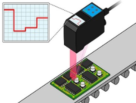
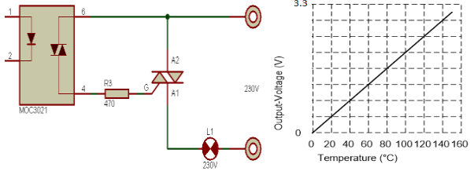
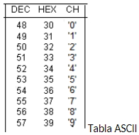

# Exam 2018 - Retake Second

## Modules 

- LPC17xx Peripheral Drivers (DAC, ADC, Timer, GPIO, DMA and UART)
- Embedded System Programming (Real-time interrupt handling, circular buffer implementation, memory-mapped register access and syncronization between peripherals)

## First Problem

En una cinta transportadora como la que se puede observar en la  imagen, se encuentra  un sensor de distancia  que nos permite medir la altura de las piezas que pasan por la ella. A su vez la cinta  nos indica que la pieza está debidamente posicionada mediante un pulso de 0.1us de duración, conectado a la placa LPCXpr1769 a través del pin P2[10], mientras el sensor de distancia lo hace através de la UART2. 

Para que el sensor entregue la medición de la distancia actual, se debe enviar un carácter ‘m’ y este devolverá cuatro caracteres codificados ASCII que representan una distancia en milímetros. Este valor está comprendido entre 0 y 1000.

A su vez en la dirección 0x10003001 se encuentra el valor del límite superior permitido de medición,  variable esta de tipo entera. Y en la dirección 0x10003002 se encuentra el valor de límite inferior permitido de medición, también una variable de tipo entera.

Se pide el software correspondiente debidamente comentado que permita realizar:

1. Cada vez que una pieza se posiciona debajo del sensor  se deberá  medir su  altura.
2. El valor de medición obtenido deberá ser convertido de ASCII (lo entregado por el sensor) a entero (utilice el método que 
considere más conveniente).
3. Se deberá  comparar el valor obtenido  de medición con los límites establecidos, de manera tal, que si la lectura obtenida satisface los límites establecidos como permitidos deberá encenderse un led verde, caso contrario se encenderá un led rojo.

<p align="center">
  
</p>

## Second Problem

El circuito de la figura permite conectar una carga L1 a la red eléctrica y controlar su encendido y apagado, en este caso la carga consiste en una resistencia  encargada de calefaccionar un horno eléctrico a los fines de establecer una temperatura deseada.

El integrado MOC3021 (Triac Opto acoplado) posee un diodo led (pines 1 y 2) y un triac activado por luz (pines 4 y 6) el circuito solo necesita para activar  la resistencia calefactora del horno encender el led.

Considere que en la dirección 0x10000025 se encuentra un dato tipo punto flotante ( float ) que tiene el valor  correspondiente a la temperatura deseada. Para tal fin se cuenta con la termocupla, cuya curva  de respuestas puede observar  en la gráfica anterior. 

Se solicita:

1. Proponga un circuito para activar led  de control mediante un pin de la LPC1769  teniendo en cuenta que Vf=3.5V  e If=15mA (valores requeridos para el funcionamiento del LED).
2. Realice  y comente el software necesario que permita el control de la temperatura del  horno, verificando su temperatura cada 1 segundo,  la termocupla antes mencionada está conectada al ADC de la LPC1769, almacene los últimos 100 datos de temperatura en un arreglo del tipo de dato que usted cocedera más conveniente.
3. Una vez que el horno supere temperatura que fue establecida en la dirección 0x10000025 se deberá apaga la resistencia, y al descender un 10% dicha temperatura se encenderá nuevamente.

<p align="center">
  
</p>

<details><summary>Summary</summary>

This task involves implementing temperature control for an electric oven using the LPC1769 microcontroller, a thermocouple connected to the ADC (Analog-to-Digital Converter), and an optotriac MOC3021 to turn the heating element on and off. 

The requirements are:

1. Design a circuit to activate the LED of the MOC3021 using a GPIO pin from the LPC1769, considering:
   - LED forward voltage (Vf): 3.5V
   - LED current (If): 15mA
2. Write a C program to:
   - Read the oven temperature every second from the thermocouple connected to the ADC.
    - We use the given voltage/temperature relation of 3.3V = 160ºC
   - Store the last 100 temperature values in a circular buffer.
   - Control the heater by:
     - Turning it off when the temperature exceeds the desired value (stored at memory address **0x10000025**).
     - Turning it on when the temperature falls below 90% of the desired value.

Considering that:

1. Code should be commented
2. Apply engineering criteria if necessary and suitable (with its corresponding justification)

</details>

<details><summary>Solution</summary>

### Part 1: Circuit Design to Activate the MOC3021 LED

Since the **LPC1769** GPIO output provides 3.3V (not enough to directly drive the MOC3021 LED with 3.5V and 15mA), a **transistor amplifier** is required.

#### Circuit Steps:
1. Connect a GPIO pin (e.g., P0.20) to the **base** of an **NPN transistor** through a **1kΩ resistor** to limit the base current.
    - Because we are using an **NPN transistor**, we will use **positive logic**, so we will need to configure a Pull-Down resistor later on (if it was a PNP transistor, it would be a Pull-Up resistor)
2. The **collector** of the transistor connects to the **cathode (pin 2)** of the **MOC3021 LED** (if it was a PNP transistor, it should be connected to the anode).
3. The **emitter** of the transistor connects to **ground** (if it was a PNP transistor, it should be connected to Vcc).
4. The **anode (pin 1)** of the LED connects to a **3.5V power source** through a **current-limiting resistor (150Ω)**, calculated as:

   $$ R = \frac{V_{source} - V_{f}}{I_f} = \frac{3.5V - 1.2V}{0.015A} \approx 150 \Omega $$

Where 1.2V is the voltage drop across the transistor's **collector-emitter (VCEsat)** when active.

### Part 2: C Code for Temperature Control

The following code reads the temperature from the thermocouple, stores the last 100 readings in a circular buffer, and controls the heater via the MOC3021 based on the desired temperature.

```c
/**
* @file r2-2018-ex2.c
* @brief Solution for the Second Problem of the Retake for the Second 2018 Exam from Digital Electronics 3
* @author Ignacio Ledesma
* @license MIT
* @date 2024-11
*/

#include "LPC17xx.h"
#include "lpc17xx_adc.h"
#include "lpc17xx_gpio.h"
#include "lpc17xx_timer.h"
#include "lpc17xx_pinsel.h"

// Pin Definitions
#define ADC_CHANNEL_2 2           // Thermocouple connected to ADC channel 2
#define MOC3021_PIN (1 << 20)     // MOC3021 control pin (P0.20)
#define TEMPERATURE_ADDRESS 0x10000025 // Memory address for desired temperature
#define ADC_FREQ 100000           // ADC frequency
#define SAVED_TEMPS 100           // Circular buffer size
#define OUTPUT 1

// Global Variables
float temperatura_deseada = *(float *)TEMPERATURE_ADDRESS;  // Desired temperature (from memory)
float temperaturas[SAVED_TEMPS];  // Circular buffer for last 100 temperature readings
uint8_t indice = 0;               // Index for circular buffer

// Function Prototypes
void config_pins(void);
void config_adc(void);
void config_timer0(void);
void leer_temperatura(void);

int main(void) {
    // System Initialization
    SystemInit();
    config_pins();
    config_adc();
    config_timer0();

    // Start Timer0
    TIM_Cmd(LPC_TIM0, ENABLE);

    while (1) {
        // Main loop (interrupt-driven)
    }

    return 0;
}

/**
 * @brief Configures GPIO pins for the MOC3021 and ADC pins for the thermocouple.
 */
void config_pins(void) {
    PINSEL_CFG_Type PinCfg;

    // Configure P0.20 as GPIO for MOC3021 control
    PinCfg.Portnum = PINSEL_PORT_0;
    PinCfg.Pinnum = 20;
    PinCfg.Funcnum = PINSEL_FUNC_0;    // GPIO function
    PinCfg.Pinmode = PINSEL_PINMODE_DOWN; // Pull-down enabled
    PinCfg.OpenDrain = PINSEL_PINMODE_NORMAL; // Normal mode
    PINSEL_ConfigPin(&PinCfg);

    // Set MOC3021 pin as output
    GPIO_SetDir(PINSEL_PORT_0, MOC3021_PIN, OUTPUT);

    // Configure P0.25 as ADC input for thermocouple
    PinCfg.Portnum = PINSEL_PORT_0;
    PinCfg.Pinnum = 25;
    PinCfg.Funcnum = PINSEL_FUNC_1;    // ADC function
    PinCfg.Pinmode = PINSEL_PINMODE_TRISTATE; // Tristate mode for precise readings
    PINSEL_ConfigPin(&PinCfg);
}

/**
 * @brief Configures ADC for thermocouple readings.
 */
void config_adc(void) {
    // Initialize ADC with 100 kHz frequency
    ADC_Init(LPC_ADC, ADC_FREQ);
    ADC_ChannelCmd(LPC_ADC, ADC_CHANNEL_2, ENABLE);  // Enable ADC channel 2
}

/**
 * @brief Configures Timer0 to generate interrupts every 1 second.
 */
void config_timer0(void) {
    TIM_TIMERCFG_Type TimerCfg;
    TIM_MATCHCFG_Type MatchCfg;

    // Timer configuration (1 ms increments)
    TimerCfg.PrescaleOption = TIM_PRESCALE_USVAL;
    TimerCfg.PrescaleValue = 1000;  // Increment timer every 1 ms
    TIM_Init(LPC_TIM0, TIM_TIMER_MODE, &TimerCfg);

    // Match configuration for 1-second interrupt
    MatchCfg.MatchChannel = 0;
    MatchCfg.IntOnMatch = ENABLE;  // Enable interrupt on match
    MatchCfg.ResetOnMatch = ENABLE;  // Reset timer on match
    MatchCfg.StopOnMatch = DISABLE;
    MatchCfg.MatchValue = 1000;  // Generate interrupt every 1 second
    TIM_ConfigMatch(LPC_TIM0, &MatchCfg);

    // Enable Timer0 interrupt
    NVIC_EnableIRQ(TIMER0_IRQn);
}

/**
 * @brief Timer0 interrupt handler for periodic temperature reading and heater control.
 */
void TIMER0_IRQHandler(void) {
    // Read and process the current temperature
    leer_temperatura();

    // Clear Timer0 interrupt flag
    TIM_ClearIntPending(LPC_TIM0, TIM_MR0_INT);
}

/**
 * @brief Reads the current temperature from the thermocouple and controls the heater.
 */
void leer_temperatura(void) {
    // Start ADC conversion
    ADC_StartCmd(LPC_ADC, ADC_START_NOW);

    // Wait for conversion to complete
    while (!ADC_ChannelGetStatus(LPC_ADC, ADC_CHANNEL_2, ADC_DATA_DONE));

    // Read ADC value and convert to voltage
    uint16_t adc_value = ADC_ChannelGetData(LPC_ADC, ADC_CHANNEL_2);
    float voltage = (adc_value / 4095.0) * 3.3;  // Convert to voltage (0-3.3V)
    float temperatura_actual = (voltage / 3.3) * 160.0;  // Convert to temperature (°C)

    // Store the temperature in the circular buffer
    temperaturas[indice] = temperatura_actual;
    indice = (indice + 1) % SAVED_TEMPS;

    // Heater control logic
    if (temperatura_actual >= temperatura_deseada) {
        // Turn off heater if temperature exceeds desired value
        GPIO_ClearValue(PINSEL_PORT_0, MOC3021_PIN);
    } else if (temperatura_actual <= (temperatura_deseada * 0.9)) {
        // Turn on heater if temperature falls below 90% of desired value
        GPIO_SetValue(PINSEL_PORT_0, MOC3021_PIN);
    }
}
```
</details>

## Third Problem

Considerando que se tiene un bloque de datos comprendidos entre las posiciones de memorias, dirección inicial= 0x10000800 a la dirección final= 0x10001000 ambas inclusive y se desea trasladar este bloque  de datos a una nueva zona de memoria comprendida entre la dirección inicial= 0x10002800 y la dirección Final=0x10003000 (en el mismo orden). Teniendo en cuenta además que los datos contenidos dentro de la zona de  memoria son de 32 bits (AHB Master endianness configuration - por defecto) y que estos deben moverse de a uno (1)  en cada evento de DMA, tenga en cuenta que se sincronizará la transmisión con evento de match0 del timer1.

- Se pide, utilizando CMSIS, que  realice el programa, debidamente comentado , que permita realizar la tarea antes mencionada.
- Indique claramente cuántos datos hay en esa zona de memoria

<p align="center">
  
</p>

<details><summary>Summary</summary>

This problem involves transferring a block of data from memory address 0x10000800 to 0x10001000 into a new memory area starting at 0x10002800 and ending at 0x10003000. The key requirements are:

1. Data width is 32 bits (4 bytes).
2. The transfer must occur one word at a time, triggered by the Match0 event of Timer1.
3. Use DMA (Direct Memory Access) to handle the data transfer efficiently.

Considering that:

1. Code should be commented
2. Apply engineering criteria if necessary and suitable (with its corresponding justification)

</details>

<details><summary>Solution</summary>

## Points to Consider for DMA Configuration

### 1. Source and Destination Addresses

- **Source Address:** The data block begins at **0x10000800** and ends at **0x10001000**. These are the memory locations of the original data.
- **Destination Address:** The data block must be transferred to **0x10002800 to 0x10003000**. These are the target memory addresses for the transfer.

### 2. Data Block Size and Number of Transfers

- The total block size is:  

   $$0x10003000 - 0x10002800 = 0x200 bytes = 512 \text{ bytes}$$

- The data width is **32 bits** (4 bytes per word).
- The total number of transfers required is:  
  $$\frac{512 \text{ bytes}}{4 \text{ bytes per transfer}} = 128 \text{ transfers} $$

### 3. DMA Transfer Mode

- Configure the DMA in **Memory-to-Memory (M2M)** mode to transfer data from one memory location to another without CPU intervention.

### 4. Linked List Item (LLI) Configuration

- Use a **Linked List Item (LLI)** to:
  - Automatically update source and destination addresses after each transfer.
  - Generate an **interrupt** at the end of each transfer to monitor progress.
  - Optimize transfer efficiency by organizing data movements over time.

### 5. Synchronization with Timer1

- The DMA transfer must be synchronized with **Timer1 Match0 events**.
- Configure Timer1 to generate an interrupt at regular intervals, triggering the DMA to transfer one word per event.

## C Code Implementation

```c
/**
* @file r2-2018-ex3.c
* @brief Solution for the Third Problem of the Retake for the Second 2018 Exam from Digital Electronics 3
* @author Ignacio Ledesma
* @license MIT
* @date 2024-11
*/

#include "LPC17xx.h"
#include "lpc17xx_gpdma.h"
#include "lpc17xx_timer.h"

// Memory addresses
#define SRC_ADDRESS 0x10000800
#define DST_ADDRESS 0x10002800

// DMA definitions
#define DMA_CHANNEL_0 0
#define REQUIRED_TRANSFERS 128 // Total transfers: 512 bytes / 4 bytes per transfer = 128

// Global variables
volatile uint8_t remaining_transfers = REQUIRED_TRANSFERS; // Tracks the remaining transfers

// DMA and Linked List Item (LLI) structures
GPDMA_Channel_CFG_Type dma;
GPDMA_LLI_Type lli;

/**
 * @brief Configures the DMA for 32-bit memory-to-memory transfers.
 */
void configure_dma(void) {
    // Configure Linked List Item (LLI)
    lli.SrcAddr = (uint32_t)SRC_ADDRESS;
    lli.DstAddr = (uint32_t)DST_ADDRESS;
    lli.NextLLI = (uint32_t)&lli; // Self-linked for repeated transfers
    lli.Control = (1 << 0)  // Transfer size = 1 word (32 bits)
                | (2 << 17) // Source width = 32 bits
                | (2 << 21) // Destination width = 32 bits
                | (1 << 25) // Increment source address
                | (1 << 26) // Increment destination address
                | (1 << 31); // Interrupt at end of transfer

    // Configure DMA channel
    dma.ChannelNum = DMA_CHANNEL_0;
    dma.TransferSize = 1; // Transfer one word at a time
    dma.TransferWidth = GPDMA_WIDTH_WORD; // 32-bit transfers
    dma.SrcMemAddr = (uint32_t)SRC_ADDRESS;
    dma.DstMemAddr = (uint32_t)DST_ADDRESS;
    dma.TransferType = GPDMA_TRANSFERTYPE_M2M; // Memory-to-Memory transfer
    dma.DMALLI = (uint32_t)&lli; // Linked List Item address
    dma.SrcConn = 0; // No peripheral source
    dma.DstConn = 0; // No peripheral destination

    // Initialize DMA
    GPDMA_Init();
    GPDMA_Setup(&dma);

    // Enable DMA interrupt
    NVIC_EnableIRQ(DMA_IRQn);
    NVIC_SetPriority(DMA_IRQn, 0);
}

/**
 * @brief Configures Timer1 to generate Match0 events at regular intervals.
 */
void configure_timer1(void) {
    TIM_TIMERCFG_Type timer_cfg;
    TIM_MATCHCFG_Type match_cfg;

    // Configure Timer1 to increment every 1 microsecond
    timer_cfg.PrescaleOption = TIM_PRESCALE_USVAL;
    timer_cfg.PrescaleValue = 1; // Timer ticks every 1 us
    TIM_Init(LPC_TIM1, TIM_TIMER_MODE, &timer_cfg);

    // Configure Match0 to generate events every 1 millisecond
    match_cfg.MatchChannel = 0;
    match_cfg.IntOnMatch = ENABLE;
    match_cfg.ResetOnMatch = ENABLE;
    match_cfg.StopOnMatch = DISABLE;
    match_cfg.MatchValue = 1000; // Match every 1 ms
    TIM_ConfigMatch(LPC_TIM1, &match_cfg);

    // Enable Timer1 interrupt
    NVIC_EnableIRQ(TIMER1_IRQn);
    NVIC_SetPriority(TIMER1_IRQn, 3);
}

/**
 * @brief Timer1 Match0 interrupt handler to trigger DMA transfers.
 */
void TIMER1_IRQHandler(void) {
    if (TIM_GetIntStatus(LPC_TIM1, TIM_MR0_INT)) {
        // Trigger DMA transfer
        GPDMA_ChannelCmd(DMA_CHANNEL_0, ENABLE);
        TIM_ClearIntPending(LPC_TIM1, TIM_MR0_INT); // Clear Timer1 interrupt flag
    }
}

/**
 * @brief DMA interrupt handler to track and manage transfers.
 */
void DMA_IRQHandler(void) {
    if (GPDMA_IntGetStatus(GPDMA_STATCLR_INTTC, DMA_CHANNEL_0)) {
        remaining_transfers--; // Decrement remaining transfers

        // Stop Timer1 if all transfers are complete
        if (remaining_transfers == 0) {
            TIM_Cmd(LPC_TIM1, DISABLE);
        } else {
            GPDMA_ClearIntPending(GPDMA_STATCLR_INTTC, DMA_CHANNEL_0); // Clear DMA interrupt flag
        }
    }
}

int main(void) {
    SystemInit(); // Initialize system clock

    // Configure Timer1 and DMA
    configure_timer1();
    configure_dma();

    // Start Timer1
    TIM_Cmd(LPC_TIM1, ENABLE);

    while (1) {
        // Wait for DMA to complete transfers
        __WFI();
    }

    return 0;
}
```

</details>
