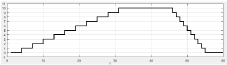

# Exam 2018 - Second

## Modules 

- LPC17xx Peripheral Drivers (DAC, Timer, GPIO, DMA and UART)
- Embedded System Programming (Trapezoidal Wave Generation, Memory Transfer with Synchronization)

## First Problem

Utilizando CMSIS escriba y comente un código que genere una onda del tipo trapezoidal a la salida del DAC como se muestra en la figura. Para ello el DAC comenzará, a partir de cero, a incrementar su valor de a un bits hasta llegar a un valor máximo que se mantendrá un tiempo dado y luego decrementará de a un bits hasta volver a cero nuevamente. Los controles del valor máximo y los tiempos de duración de los escalones de subida y bajada están organizados en la posición de memoria 0x10004000 de la siguiente forma:

- bits 0 a 7: valor máximo a alcanzar por el DAC.
- bits 8 a 15: valor a utilizar en una función de demora que define el tiempo que se mantiene el valor máximo.
- bits 16 a 23: valor a utilizar en una función de demora para definir el tiempo que se mantiene cada incremento de 1 bits en la subida.
- bits 24 a 31: valor a utilizar en una función de demora para definir el tiempo que se mantiene cada decremento de 1 bits en bajada.

<p align="center">
  
</p>

<details><summary>Summary</summary>

Using CMSIS, implement a program that generates a trapezoidal wave on the DAC output of the LPC1769 as shown in the figure. The requirements are:

1. The DAC output starts at 0, increases in steps of 1 until it reaches a maximum value.
2. The maximum value is held for a specific duration, then decreases back to 0 in steps of 1.
3. The maximum value, hold time, rise time, and fall time are configured through memory at address 0x10004000:
   - Bits 0–7: Maximum value for the DAC.
   - Bits 8–15: Time to hold the maximum value (in milliseconds).
   - Bits 16–23: Time for each step increment during the rise phase (in milliseconds).
   - Bits 24–31: Time for each step decrement during the fall phase (in milliseconds).

Considering that:

1. Code should be commented
2. Apply engineering criteria if necessary and suitable (with its corresponding justification)

</details>

<details><summary>Solution</summary>

```c
/**
* @file e2-2018-ex1.c
* @brief Solution for the First Problem of the Second 2018 Exam from Digital Electronics 3
* @author Ignacio Ledesma
* @license MIT
* @date 2024-11
*/

#include "LPC17xx.h"
#include "lpc17xx_pinsel.h"
#include "lpc17xx_dac.h"
#include "lpc17xx_timer.h"

// Memory addresses and bit masks
#define CONTROL_ADDRESS 0x10004000
#define MAX_VALUE_BITS 0x000000FF
#define HOLD_TIME_BITS 0x0000FF00
#define RISE_TIME_BITS 0x00FF0000
#define FALL_TIME_BITS 0xFF000000

// Timer match channel
#define MATCH_CHANNEL_0 0

// Global variables
volatile uint8_t match_flag = 0; // Indicates when a timer match occurs

// Function prototypes
void config_pins(void);
void config_dac(void);
void config_timer(void);
void delay_with_timer(uint8_t time);

int main(void) {
    SystemInit(); // Initialize system clock

    // Configure peripherals
    config_pins();
    config_dac();
    config_timer();

    // Load control values from memory
    uint32_t control_values = *((uint32_t*)CONTROL_ADDRESS);
    uint8_t max_value = (control_values & MAX_VALUE_BITS); // Maximum DAC value
    uint8_t min_value = 0; // Minimum DAC value (always 0)
    uint8_t hold_time = (control_values & HOLD_TIME_BITS) >> 8; // Time to hold max value
    uint8_t rise_time = (control_values & RISE_TIME_BITS) >> 16; // Time for each step increment
    uint8_t fall_time = (control_values & FALL_TIME_BITS) >> 24; // Time for each step decrement

    uint16_t dac_value = 0; // DAC output value (8-bit resolution)

    while (1) {
        // Rising phase: Increment DAC value from 0 to max_value
        for (dac_value = 0; dac_value <= max_value; dac_value++) {
            DAC_UpdateValue(LPC_DAC, dac_value); // Update DAC output
            delay_with_timer(rise_time); // Delay between increments
        }

        // Hold phase: Maintain max_value for the specified time
        DAC_UpdateValue(LPC_DAC, max_value);
        delay_with_timer(hold_time);

        // Falling phase: Decrement DAC value from max_value to 0
        for (dac_value = max_value; dac_value > min_value; dac_value--) {
            DAC_UpdateValue(LPC_DAC, dac_value); // Update DAC output
            delay_with_timer(fall_time); // Delay between decrements
        }

        // Settling phase: Maintain 0 for the specified time
        DAC_UpdateValue(LPC_DAC, min_value);
        delay_with_timer(hold_time);
    }

    return 0;
}

/**
 * @brief Configures the DAC output pin (P0.26).
 */
void config_pins(void) {
    PINSEL_CFG_Type pin;
    pin.Portnum = PINSEL_PORT_0;
    pin.Pinnum = PINSEL_PIN_26;
    pin.Funcnum = PINSEL_FUNC_2; // Set pin function as DAC
    pin.Pinmode = PINSEL_PINMODE_TRISTATE; // Tristate mode
    pin.OpenDrain = PINSEL_PINMODE_NORMAL; // Normal mode
    PINSEL_ConfigPin(&pin);
}

/**
 * @brief Configures the DAC peripheral.
 */
void config_dac(void) {
    DAC_CONVERTER_CFG_Type dac;
    dac.CNT_ENA = RESET; // Disable DAC counter
    dac.DMA_ENA = RESET; // Disable DMA
    dac.DBLBUF_ENA = RESET; // Disable double buffering
    DAC_ConfigDAConverterControl(LPC_DAC, &dac);
    DAC_Init(LPC_DAC); // Initialize DAC
}

/**
 * @brief Configures Timer0 for generating delays.
 */
void config_timer(void) {
    TIM_TIMERCFG_Type timer;
    TIM_MATCHCFG_Type match;

    // Configure Timer0 with a 1ms resolution
    timer.PrescaleOption = TIM_PRESCALE_USVAL; // Use microsecond prescaler
    timer.PrescaleValue = 1000; // 1ms resolution
    TIM_Init(LPC_TIM0, TIM_TIMER_MODE, &timer);

    // Configure match settings for Timer0
    match.MatchChannel = MATCH_CHANNEL_0;
    match.IntOnMatch = ENABLE; // Enable interrupt on match
    match.StopOnMatch = ENABLE; // Stop timer on match
    match.ResetOnMatch = ENABLE; // Reset timer on match
    TIM_ConfigMatch(LPC_TIM0, &match);

    // Enable Timer0 interrupt in the NVIC
    NVIC_EnableIRQ(TIMER0_IRQn);
}

/**
 * @brief Delays execution using Timer0.
 * @param time Time in milliseconds to delay.
 */
void delay_with_timer(uint8_t time) {
    match_flag = 0; // Reset match flag
    TIM_UpdateMatchValue(LPC_TIM0, MATCH_CHANNEL_0, time); // Set match value
    TIM_Cmd(LPC_TIM0, ENABLE); // Start Timer0
    while (!match_flag); // Wait until match flag is set
}

/**
 * @brief Timer0 interrupt handler.
 */
void TIMER0_IRQHandler(void) {
    if (TIM_GetIntStatus(LPC_TIM0, TIM_MR0_INT)) { // Check if match occurred
        TIM_ClearIntPending(LPC_TIM0, TIM_MR0_INT); // Clear interrupt flag
        match_flag = 1; // Set match flag
    }
}
```
</details>

## Second Problem

Utilizando CMSIS y considerando una frecuencia de cpu de 100 Mhz, escriba y comente un código que configure una recepción por interrupciones UART con una trama que cumpla las siguientes características: Baudrate de 19200 baudios, paridad par, largo de palabra de datos de 8 bits y 1 bit de stop.
El programa debe permitir recibir por UART, 32 bits que van a ser guardados en la posición de memoria 0x10006000. Una vez finalizada toda la recepción se deshabilitará su interrupción.
A modo de ejemplo, realice un diagrama temporal de las dos primeras tramas recibidas, identificando cada una de las partes que constituyen dichas tramas.

## Third Problem

Considerando que se tiene un bloque de datos comprendidos entre las posiciones de memorias, dirección inicial= 0x10000800 a la dirección final= 0x10001000 ambas inclusive y se desea trasladar este bloque de datos una nueva zona de memoria comprendida entre la dirección inicial= 0x10002800 y la dirección Final=0x10003000 (en el mismo orden). Teniendo en cuenta además que los datos contenidos dentro de la zona de memoria son de 16 bits (AHB Master endianness configuration - por defecto) y que estos deben moverse de a uno (1) en cada evento de DMA, se sincronizará la transmisión con evento de match0 del timer1.
Se pide que Enumere y explique los puntos a tener en cuenta para configurar correctamente el controlador DMA.

<details><summary>Summary</summary>

This problem involves transferring a block of data from memory address 0x10000800 to 0x10001000 into a new memory area starting at 0x10002800 and ending at 0x10003000. The key requirements are:

1. Data width is 16 bits (2 bytes -> default AHB Master endianness configuration).
2. The transfer must occur one word at a time, triggered by the Match0 event of Timer1.
3. Use DMA (Direct Memory Access) to handle the data transfer efficiently.

Considering that:

1. Code should be commented
2. Apply engineering criteria if necessary and suitable (with its corresponding justification)

</details>

<details><summary>Solution</summary>

## Points to Consider for Proper DMA Configuration

### 1. **Source and Destination Addresses**
- **Source Address:** The block of data starts at **0x10000800** and ends at **0x10001000**. These are the initial locations of the data to be transferred.
- **Destination Address:** The block of data must be copied to the range **0x10002800** to **0x10003000**. These are the target memory addresses for the data.

### 2. **Block Size, Data Width, and Number of Transfers**
- The total block size is:  

   $$0x10003000 - 0x10002800 = 0x200 bytes = 512 \text{ bytes}$$

- The data width is **16 bits** (2 bytes per word) as required by the **AHB Master endianness configuration**.
- The total number of transfers required is:  
  $$\frac{512 \text{ bytes}}{2 \text{ bytes per transfer}} = 256 \text{ transfers} $$

### 3. **DMA Transfer Mode**
- The DMA should be configured in **Memory-to-Memory (M2M)** mode. This mode allows data to be read from a source memory location and copied to a destination memory location.

### 4. **Linked List Item (LLI) Structure**
- A **Linked List Item (LLI)** must be configured to:
  - Iterate through the source and destination memory blocks automatically after each transfer.
  - Optionally generate an **interrupt** after each transfer is completed to track the progress of the operation.
  - This ensures efficient and well-organized data transfers without manual intervention.

### 5. **Synchronization with Timer1**
- The DMA transfers must be synchronized with the **Match0 event** of **Timer1**.
- The Timer1 match event will act as a trigger, ensuring that the DMA performs a transfer only when this event occurs.
- To achieve this, the Timer1 interrupt is configured to trigger the DMA controller upon each match event.

## Code Implementation

```c
/**
* @file e2-2018-ex3.c
* @brief Solution for the Third Problem of the Second 2018 Exam from Digital Electronics 3
* @author Ignacio Ledesma
* @license MIT
* @date 2024-11
*/

#include "LPC17xx.h"
#include "lpc17xx_gpdma.h"
#include "lpc17xx_timer.h"

// Memory addresses
#define SRC_ADDRESS 0x10000800
#define DST_ADDRESS 0x10002800

// DMA definitions
#define DMA_CHANNEL_0 0
#define REQUIRED_TRANSFERS 256 // Total transfers: 512 bytes / 2 bytes per transfer = 256

// Global variables
volatile uint16_t remaining_transfers = REQUIRED_TRANSFERS;

// DMA and LLI structures
GPDMA_Channel_CFG_Type dma;
GPDMA_LLI_Type lli;

/**
 * @brief Configures DMA for memory-to-memory transfer with 16-bit data width.
 */
void configure_dma(void) {
    // Configure Linked List Item (LLI)
    lli.SrcAddr = (uint32_t)SRC_ADDRESS;
    lli.DstAddr = (uint32_t)DST_ADDRESS;
    lli.NextLLI = (uint32_t)&lli; // Self-linked for repeated transfers
    lli.Control = (1 << 0)  // Transfer size = 1 (one halfword per transfer)
                | (1 << 17) // Source transfer width = 16 bits
                | (1 << 21) // Destination transfer width = 16 bits
                | (1 << 25) // Increment source address after each transfer
                | (1 << 26) // Increment destination address after each transfer
                | (1 << 31); // Enable interrupt on transfer completion

    // Configure DMA channel
    dma.ChannelNum = DMA_CHANNEL_0;
    dma.TransferSize = 1; // Transfer 1 halfword at a time
    dma.TransferWidth = GPDMA_WIDTH_HALFWORD;
    dma.SrcMemAddr = (uint32_t)SRC_ADDRESS;
    dma.DstMemAddr = (uint32_t)DST_ADDRESS;
    dma.TransferType = GPDMA_TRANSFERTYPE_M2M;
    dma.DMALLI = (uint32_t)&lli; // Linked List Item address
    dma.SrcConn = 0; // No peripheral for source
    dma.DstConn = 0; // No peripheral for destination

    // Initialize DMA
    GPDMA_Init();
    GPDMA_Setup(&dma);

    // Enable DMA interrupt
    NVIC_EnableIRQ(DMA_IRQn);
    NVIC_SetPriority(DMA_IRQn, 0);
}

/**
 * @brief Configures Timer1 for Match0 event generation.
 */
void configure_timer1(void) {
    TIM_TIMERCFG_Type timer_cfg;
    TIM_MATCHCFG_Type match_cfg;

    // Configure Timer1 to increment every 1 us
    timer_cfg.PrescaleOption = TIM_PRESCALE_USVAL;
    timer_cfg.PrescaleValue = 1; // Timer ticks every 1 us
    TIM_Init(LPC_TIM1, TIM_TIMER_MODE, &timer_cfg);

    // Configure Match0 to generate events every 1 ms
    match_cfg.MatchChannel = 0;
    match_cfg.IntOnMatch = ENABLE;
    match_cfg.ResetOnMatch = ENABLE;
    match_cfg.StopOnMatch = DISABLE;
    match_cfg.MatchValue = 1000; // Match event every 1 ms
    TIM_ConfigMatch(LPC_TIM1, &match_cfg);

    // Enable Timer1 interrupt
    NVIC_EnableIRQ(TIMER1_IRQn);
    NVIC_SetPriority(TIMER1_IRQn, 3);
}

/**
 * @brief Timer1 Match0 interrupt handler.
 *        Triggers the DMA for the next transfer.
 */
void TIMER1_IRQHandler(void) {
    if (TIM_GetIntStatus(LPC_TIM1, TIM_MR0_INT)) {
        GPDMA_ChannelCmd(DMA_CHANNEL_0, ENABLE); // Trigger DMA transfer
        TIM_ClearIntPending(LPC_TIM1, TIM_MR0_INT); // Clear Timer1 interrupt flag
    }
}

/**
 * @brief DMA interrupt handler.
 *        Tracks the number of remaining transfers.
 */
void DMA_IRQHandler(void) {
    if (GPDMA_IntGetStatus(GPDMA_STATCLR_INTTC, DMA_CHANNEL_0)) {
        remaining_transfers--;

        // Check if all transfers are complete
        if (remaining_transfers == 0) {
            TIM_Cmd(LPC_TIM1, DISABLE); // Stop Timer1
        } else {
            GPDMA_ClearIntPending(GPDMA_STATCLR_INTTC, DMA_CHANNEL_0); // Clear DMA interrupt flag
        }
    }
}

int main(void) {
    SystemInit(); // Initialize system clock

    configure_timer1(); // Configure Timer1
    configure_dma();    // Configure DMA

    TIM_Cmd(LPC_TIM1, ENABLE); // Start Timer1

    while (1) {
        // Wait for DMA to complete transfers
        __WFI();
    }

    return 0;
}
```

</details>