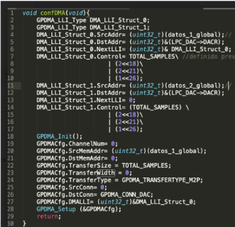

# Exam 2022 - Second

## Modules 

- LPC17xx Peripheral Drivers (ADC, DAC, DMA, Timer, GPIO)
- Embedded System Programming (Real-Time Sampling and Buffer Management)

## First Problem

Programar  el  microcontrolador  LPC1769  para  que  mediante  su  ADC  digitalice dos señales analógicas cuyos anchos de bandas son de 10 Khz cada una. Los canales utilizados deben ser el  2  y  el  4  y  los  datos  deben  ser  guardados  en  dos  regiones  de  memorias  distintas  que permitan contar con los últimos 20 datos de cada canal. Suponer una frecuencia de core cclk de 100 Mhz. El código debe estar debidamente comentado.

<details><summary>Summary</summary>

This problem involves digitizing two analog signals and storing their values in memory using an interrupt-driven architecture. 

The requirements are:

    1. Configure the **ADC** to digitize signals from **Channel 2** and **Channel 4**.
    2. Use **Timer0** to synchronize ADC sampling at a **20 kHz rate** (50 µs intervals).
    3. Store the last **20 samples** from each channel in separate circular buffers.
    4. Ensure that all operations are handled via **interrupts** for real-time processing.

Considering that:

    1. Code should be commented
    2. Apply engineering criteria if necessary and suitable (with its corresponding justification)

</details>

<details><summary>Solution</summary>

```c
/**
* @file e2-2022-ex1.c
* @brief Solution for the First Problem of the Second 2022 Exam from Digital Electronics 3
* @author Ignacio Ledesma
* @license MIT
* @date 2024-11
*/

#include "LPC17xx.h"
#include "lpc17xx_adc.h"
#include "lpc17xx_pinsel.h"
#include "lpc17xx_timer.h"

// Definitions
#define NUM_DATOS 20                // Buffer size for each channel
#define ADC_FREQ 100000             // ADC frequency (100 kHz)

// Global Variables
uint16_t buffer_canal_2[NUM_DATOS] = {0};  // Buffer for Channel 2
uint16_t buffer_canal_4[NUM_DATOS] = {0};  // Buffer for Channel 4
uint8_t indice_canal_2 = 0;                // Circular buffer index for Channel 2
uint8_t indice_canal_4 = 0;                // Circular buffer index for Channel 4

// Function Prototypes
void config_pins(void);
void init_adc(void);
void init_timer0(void);
void guardar_datos(uint16_t valor, uint8_t canal);

int main(void) {
    // Initialize system clock
    SystemInit();

    // Configure ADC pins
    config_pins();

    // Initialize ADC
    init_adc();

    // Initialize Timer0 to generate interrupts at 20 kHz (50 µs intervals)
    init_timer0();

    // Main loop
    while (1) {
        // ADC data transfer and processing handled in interrupts
    }

    return 0;
}

/**
 * @brief Configure ADC pins for Channel 2 and Channel 4.
 */
void config_pins(void) {
    PINSEL_CFG_Type pin;

    // Configure P0.25 as ADC input for Channel 2
    pin.Portnum = PINSEL_PORT_0;
    pin.Pinnum = PINSEL_PIN_25;
    pin.Funcnum = PINSEL_FUNC_1; // ADC function
    pin.Pinmode = PINSEL_PINMODE_TRISTATE;
    pin.OpenDrain = PINSEL_PINMODE_NORMAL;
    PINSEL_ConfigPin(&pin);

    // Configure P1.30 as ADC input for Channel 4
    pin.Portnum = PINSEL_PORT_1;
    pin.Pinnum = PINSEL_PIN_30;
    pin.Funcnum = PINSEL_FUNC_2; // ADC function
    pin.Pinmode = PINSEL_PINMODE_TRISTATE;
    PINSEL_ConfigPin(&pin);
}

/**
 * @brief Initialize ADC for Channels 2 and 4.
 */
void init_adc(void) {
    // Initialize ADC with a frequency of 100 kHz
    ADC_Init(LPC_ADC, ADC_FREQ);

    // Enable Channels 2 and 4
    ADC_ChannelCmd(LPC_ADC, ADC_CHANNEL_2, ENABLE);
    ADC_ChannelCmd(LPC_ADC, ADC_CHANNEL_4, ENABLE);

    // Disable burst mode
    ADC_BurstCmd(LPC_ADC, DISABLE);

    // Configure ADC to start conversions on Timer0 Match1 events
    ADC_StartCmd(LPC_ADC, ADC_START_ON_MAT01);
}

/**
 * @brief Initialize Timer0 to trigger at 20 kHz (50 µs intervals).
 */
void init_timer0(void) {
    TIM_TIMERCFG_Type timerCfg;
    TIM_MATCHCFG_Type matchCfg;

    // Configure Timer0
    timerCfg.PrescaleOption = TIM_PRESCALE_USVAL;
    timerCfg.PrescaleValue = 1;  // Timer increments every 1 µs
    TIM_Init(LPC_TIM0, TIM_TIMER_MODE, &timerCfg);

    // Configure Match1 to trigger every 50 µs (20 kHz sampling rate)
    matchCfg.MatchChannel = 1;
    matchCfg.IntOnMatch = ENABLE;   // Enable interrupt on match
    matchCfg.ResetOnMatch = ENABLE; // Reset timer on match
    matchCfg.StopOnMatch = DISABLE;
    matchCfg.MatchValue = 50;       // Match value for 50 µs
    TIM_ConfigMatch(LPC_TIM0, &matchCfg);

    // Enable Timer0
    TIM_Cmd(LPC_TIM0, ENABLE);

    // Enable Timer0 interrupt
    NVIC_EnableIRQ(TIMER0_IRQn);
}

/**
 * @brief Timer0 interrupt handler to trigger ADC conversions and store results.
 */
void TIMER0_IRQHandler(void) {
    // Wait for Channel 2 conversion to complete
    while (!ADC_ChannelGetStatus(LPC_ADC, ADC_CHANNEL_2, ADC_DATA_DONE));
    uint16_t valor_canal_2 = ADC_ChannelGetData(LPC_ADC, ADC_CHANNEL_2);

    // Wait for Channel 4 conversion to complete
    while (!ADC_ChannelGetStatus(LPC_ADC, ADC_CHANNEL_4, ADC_DATA_DONE));
    uint16_t valor_canal_4 = ADC_ChannelGetData(LPC_ADC, ADC_CHANNEL_4);

    // Store Channel 2 data
    guardar_datos(valor_canal_2, ADC_CHANNEL_2);

    // Store Channel 4 data
    guardar_datos(valor_canal_4, ADC_CHANNEL_4);

    // Clear Timer0 interrupt flag
    TIM_ClearIntPending(LPC_TIM0, TIM_MR0_INT);
}

/**
 * @brief Store ADC data into circular buffers.
 * @param valor ADC value to store.
 * @param canal ADC channel (2 or 4).
 */
void guardar_datos(uint16_t valor, uint8_t canal) {
    if (canal == ADC_CHANNEL_2) {
        buffer_canal_2[indice_canal_2] = valor;  // Store in Channel 2 buffer
        indice_canal_2 = (indice_canal_2 + 1) % NUM_DATOS; // Update index circularly
    } else if (canal == ADC_CHANNEL_4) {
        buffer_canal_4[indice_canal_4] = valor;  // Store in Channel 4 buffer
        indice_canal_4 = (indice_canal_4 + 1) % NUM_DATOS; // Update index circularly
    }
}
```
</details>

## Second Problem

Utilizando el timer0, un dac, interrupciones y el driver del LPC1769 , escribir un código que permita  generar  una  señal  triangular  periódica  simétrica,  que  tenga  el  mínimo  periodo posible, la máxima excursión de voltaje pico a pico posible y el mínimo incremento de señal posible  por  el  dac.  Suponer  una  frecuencia  de  core  cclk  de  100  Mhz.  El  código  debe  estar debidamente comentado.

<details><summary>Summary</summary>

This task involves implementing a triangular waveform generator using the LPC1769 microcontroller. The requirements are:

    1. Configure **Timer0** to generate periodic interrupts with a period of 1 µs.
    2. Update the **DAC output value** in each Timer0 interrupt to create a triangular waveform:
       - Increment the DAC value linearly until it reaches the maximum.
       - Decrement the DAC value linearly back to the minimum.
    3. Use the **DAC** in high-performance mode to achieve the minimum possible period.
    4. Fully utilize the DAC's 10-bit resolution (0–1023) to maximize signal precision and peak-to-peak voltage.

Considering that:

    1. The CLK frequency is 100 MHz
    2. Code should be commented
    3. Apply engineering criteria if necessary and suitable (with its corresponding justification)

</details>

<details><summary>Solution</summary>

```c
/**
* @file e2-2022-ex2.c
* @brief Solution for the Second Problem of the Second 2022 Exam from Digital Electronics 3
* @author Ignacio Ledesma
* @license MIT
* @date 2024-11
*/

#include "LPC17xx.h"
#include "lpc17xx_dac.h"
#include "lpc17xx_timer.h"
#include "lpc17xx_pinsel.h"

// Definitions
#define FAST_MODE 0                  // DAC high-performance mode (minimum period)
#define DAC_MAX_VALUE 1023           // Maximum DAC value (10 bits)
#define DAC_MIN_VALUE 0              // Minimum DAC value (10 bits)

// Global Variables
uint16_t dac_value = 0;              // Current DAC output value
int8_t direction = 1;                // Direction of DAC update (1: increasing, -1: decreasing)

// Function Prototypes
void config_pins(void);
void init_dac(void);
void init_timer0(void);
void TIMER0_IRQHandler(void);

int main(void) {
    SystemInit(); // Initialize system clock
    
    // Configure DAC pin
    config_pins();

    // Initialize DAC
    init_dac();

    // Initialize Timer0 for periodic interrupts
    init_timer0();

    // Main loop
    while (1) {
        // Signal generation is managed by Timer0 interrupts
    }

    return 0;
}

/**
 * @brief Configure DAC pin.
 */
void config_pins(void) {
    PINSEL_CFG_Type pin;

    // Configure P0.26 as DAC output
    pin.Portnum = PINSEL_PORT_0;
    pin.Pinnum = PINSEL_PIN_26;
    pin.Funcnum = PINSEL_FUNC_2;        // DAC function
    pin.Pinmode = PINSEL_PINMODE_TRISTATE;
    pin.OpenDrain = PINSEL_PINMODE_NORMAL;
    PINSEL_ConfigPin(&pin);
}

/**
 * @brief Initialize DAC for waveform generation.
 */
void init_dac(void) {
    DAC_CONVERTER_CFG_Type dac_cfg;

    // Configure DAC
    dac_cfg.CNT_ENA = RESET;           // Disable timeout counter
    dac_cfg.DMA_ENA = RESET;           // Disable DMA
    dac_cfg.DBLBUF_ENA = RESET;        // Disable double buffering
    DAC_ConfigDAConverterControl(LPC_DAC, &dac_cfg);
    
    DAC_SetBias(LPC_DAC, FAST_MODE);   // High-performance mode for minimum period
    DAC_Init(LPC_DAC);                 // Initialize DAC
}

/**
 * @brief Initialize Timer0 to generate periodic interrupts.
 */
void init_timer0(void) {
    TIM_TIMERCFG_Type timer_cfg;
    TIM_MATCHCFG_Type match_cfg;

    // Configure Timer0 to generate interrupts every 1 µs
    timer_cfg.PrescaleOption = TIM_PRESCALE_TICKVAL;
    timer_cfg.PrescaleValue = 100;     // Divide clock to 1 MHz (100 MHz / 100)
    TIM_Init(LPC_TIM0, TIM_TIMER_MODE, &timer_cfg);

    // Configure Match0 for 1 µs intervals
    match_cfg.MatchChannel = 0;
    match_cfg.IntOnMatch = ENABLE;     // Enable interrupt on match
    match_cfg.ResetOnMatch = ENABLE;   // Reset timer on match
    match_cfg.StopOnMatch = DISABLE;   // Do not stop timer on match
    match_cfg.MatchValue = 1;          // Match every 1 µs
    TIM_ConfigMatch(LPC_TIM0, &match_cfg);

    // Enable Timer0
    TIM_Cmd(LPC_TIM0, ENABLE);

    // Enable Timer0 interrupt
    NVIC_EnableIRQ(TIMER0_IRQn);
}

/**
 * @brief Timer0 interrupt handler for waveform generation.
 */
void TIMER0_IRQHandler(void) {
    // Update DAC value
    DAC_UpdateValue(LPC_DAC, dac_value);

    // Modify DAC value based on direction
    dac_value += direction;

    // Check if DAC value has reached the maximum or minimum
    if (dac_value == DAC_MAX_VALUE) {
        direction = -1; // Switch to decreasing
    } else if (dac_value == DAC_MIN_VALUE) {
        direction = 1;  // Switch to increasing
    }

    // Clear Timer0 interrupt flag
    TIM_ClearIntPending(LPC_TIM0, TIM_MR0_INT);
}
```
</details>

## Third Problem

En la siguiente sección de código se realiza la configuración de un canal de DMA 

1. Explique detalladamente cómo queda configurado el canal, que tipo de transferencia está realizando. 
2. ¿Qué datos se transfieren, de qué posición a cuál y cuántas veces?
3. ¿Cómo  se  define  el  tiempo  de  "Interrup DMA  request"   o  el  tiempo  de  transferencia  de c/dato? 

<p align="center">
  
</p>

Desarrolle lo mas breve aunque completo posible el tema de Listas Vinculadas en LPC1769

<details><summary>Solution</summary>

## a) **Detailed explanation of the code and DMA channel configuration:**

This code uses the **LLI (Linked List Item)** structure to configure a **DMA channel** on the **LPC1769**. The **LLI** structure allows the **DMA** to perform multiple data block transfers, which may be located in non-contiguous memory, sequentially without CPU intervention. Transfers are chained using a **linked list**.

In this case, the code configures the **DMA** to transfer data from memory (**datos_1_global** and **datos_2_global**) to the **DAC** (Digital-to-Analog Converter) in the **LPC1769** microcontroller. Here's the breakdown:

1. **LLI Structures**:
   - **DMA_LLI_Struct_0** and **DMA_LLI_Struct_1** are two linked list structures. Each structure defines a specific transfer and a link to the next data block to transfer.
   - In **DMA_LLI_Struct_0**, data from **datos_1_global** is transferred to the **DAC**, and when completed, it moves on to **DMA_LLI_Struct_1**, which transfers **datos_2_global** to the **DAC**.
   - **NextLLI** defines the address of the next linked list item to execute, enabling chained transfers.

2. **Control Field Configuration**:
   - The **Control** field defines transfer settings, including the size, data width, and other configurations.
   - **DMA_SIZE | (2 << 18) | (2 << 21) | (1 << 26):**
     - **DMA_SIZE**: Total number of samples to transfer.
     - **2 << 18**: Sets the source transfer width to 32 bits (4 bytes).
     - **2 << 21**: Sets the destination transfer width to 32 bits (4 bytes).
     - **1 << 26**: Increments the destination address after each transfer.

3. **DMA Channel Configuration (GPDMA_Setup)**:
   - The function **GPDMA_Setup** configures the DMA channel to start the transfer. It defines the source (**SrcMemAddr**) and destination (**DstMemAddr**) addresses, which in this case are **datos_1_global** and the DAC register, respectively.
   - The transfer type is **memory-to-peripheral (M2P)** because data moves from memory (**datos_1_global**) to the **DAC**.

## b) **Data transferred, positions, and quantity:**

- **Data Transferred:**
  - The transferred data consists of samples stored in the arrays **datos_1_global** and **datos_2_global**.

- **Source and Destination:**
  - **Source:** Data arrays **datos_1_global** and **datos_2_global** stored in memory.
  - **Destination:** The DAC register (**LPC_DAC->DACR**) in the LPC1769.

- **Quantity:**
  - The number of samples to transfer is defined by **TOTAL_SAMPLES** in the code.
  - There are two transfer blocks: one for **datos_1_global** and another for **datos_2_global**. After the first transfer completes, the second transfer begins automatically using the linked list.

## c) **"Interrupt DMA request" timing or data transfer time:**

The timing for generating an "Interrupt DMA Request" or completing a data transfer depends on two factors:

1. **Transfer Size**:
   - The **TOTAL_SAMPLES** field in the **Control** field determines the number of samples to transfer before the interrupt is triggered. The interrupt is generated when all the samples in the block are transferred, provided that the interrupt is enabled via **(1 << 30)** in the **Control** field.

2. **DAC and DMA Clock Speeds**:
   - The DAC operates at a maximum frequency of **1 MHz** in fast mode, enabling it to process up to 1 million samples per second.
   - The DMA transfer speed depends on the system clock (100 MHz in this case) and peripheral settings.

## Linked List Items (LLI) in LPC1769

In the **LPC1769**, **Linked List Items (LLI)** allow the DMA to manage multiple transfers efficiently without requiring processor intervention. This is particularly useful for continuous or chained transfers, such as signal generation with the DAC.

1. **LLI Structure**:
   - Each LLI specifies:
     - Source and destination addresses.
     - Transfer size and configuration (e.g., data width, address incrementing).
     - Address of the next LLI in the chain.

2. **Advantages**:
   - **Efficiency:** Reduces CPU workload by automating multi-block transfers.
   - **Flexibility:** Supports different transfer configurations in a single operation.
   - **Automation:** Enables continuous data streaming to peripherals like the DAC.

3. **Operation**:
   - The DMA controller reads the current LLI, performs the transfer, and moves to the next LLI automatically.
   - Interrupts can be generated after each block to monitor progress or trigger additional actions.

In summary, **LLI** in the LPC1769 provides an efficient mechanism for managing complex DMA operations, reducing processor load, and ensuring smooth data transfer for real-time embedded applications.

</details>
