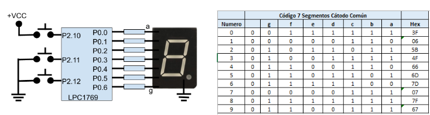

# Exam 2023 - First

## Modules 

- LPC17xx Peripheral Drivers (GPIO, EXTI, Systick, Interrupts)
- Embedded System Programming (Interrupt Handling, 7-Segment Display, Data Management with Circular Buffers)

## First Problem

Utilizando Systick e interrupciones externas escribir un código en C que cuente indefinidamente de 0 a 9. Un pulsador conectado a Eint0 reiniciará la cuenta a 0 y se mantendrá en ese valor mientras el pulsador se encuentre presionado. Un pulsador conectado a Eint1 permitirá detener o continuar la cuenta cada vez que sea presionado. Un pulsador conectado a Eint2 permitirá modificar la velocidad de incremento del contador. En este sentido, cada vez que se presione ese pulsador el contador pasará a incrementar su cuenta de cada 1 segundo a cada 1 milisegundo y viceversa. Considerar que el microcontrolador se encuentra funcionando con un reloj (cclk) de 16 Mhz. El código debe estar debidamente comentado y los cálculos realizados claramente expresados. En la siguiente figura se muestra una tabla que codifica el display y el esquema del hardware sobre el que funcionará el programa.

<p align="center">
  
</p>

<details><summary>Summary</summary>
Design a system to interact with a 7-segment display using three push buttons with the following requirements:

    1. Use the Systick timer to count and display digits on the 7-segment display.
    2. Button connected to EINT0 (P2.10): Resets the count to 0 and pauses the system until released.
    3. Button connected to EINT1 (P2.11): Toggles between pause and resume for the count.
    4. Button connected to EINT2 (P2.12): Switches the counting speed between 1 second per digit and 1 millisecond per digit.

Considering that:

    1. The microcontroller is working at a clock frequency of 16 MHz
    2. Code should be commented
    3. Calculations should be justified and written somewhere
    4. Apply engineering criteria if necessary and suitable (with its corresponding justification)

</details>

<details>
<summary>
Solution
</summary>

### 16 MHz CLK => Max Systick Time = ((2^24 - 1)/16e6)*1000 = 1048 ms

```c
/**
* @file e1-2023-ex1.c
* @brief Solution for the First Problem of the First 2023 Exam from Digital Electronics 3
* @author Ignacio Ledesma
* @license MIT
* @date 2024-11
*/

#include "LPC17xx.h"
#include "lpc17xx_exti.h"
#include "lpc17xx_gpio.h"
#include "lpc17xx_pinsel.h"
#include "lpc17xx_systick.h"

#define DEBOUNCE_DELAY 10000

// Systick time settings
#define SYSTICK_TIME_MS 1
#define DIGIT_PER_SECOND 1000
#define DIGIT_PER_MS 1

// Constants for the 7-segment display and input buttons
#define DIFFERENT_DIGITS 10
#define INPUT 1
#define OUTPUT 0

// Pin assignments
#define RESET_COUNT_PIN ((uint32_t)(1<<10)) // P2.10 for reset
#define PAUSE_RESUME_COUNT_PIN ((uint32_t)(1<<11)) // P2.11 for pause/resume
#define COUNT_RATE_PIN ((uint32_t)(1<<12)) // P2.12 for changing count rate
#define A_SEGMENT_PIN ((uint32_t)(1<<0)) // P0.0 for segment A
#define B_SEGMENT_PIN ((uint32_t)(1<<1)) // P0.1 for segment B
#define C_SEGMENT_PIN ((uint32_t)(1<<2)) // P0.2 for segment C
#define D_SEGMENT_PIN ((uint32_t)(1<<3)) // P0.3 for segment D
#define E_SEGMENT_PIN ((uint32_t)(1<<4)) // P0.4 for segment E
#define F_SEGMENT_PIN ((uint32_t)(1<<5)) // P0.5 for segment F
#define G_SEGMENT_PIN ((uint32_t)(1<<6)) // P0.6 for segment G

// Global variables
volatile uint16_t systick_interrupts = 0; // Counter for Systick interrupts
volatile uint16_t count_rate = DIGIT_PER_SECOND; // Initial count rate (1 second per digit)
FunctionalState Systick_state = ENABLE; // Systick state (enabled/disabled)
uint8_t digit = 0; // Current digit displayed 
uint8_t digit_codes[DIFFERENT_DIGITS] = { // 7-segment codes for digits 0-9
    0x3F, // 0 -> 0b00111111
    0x06, // 1 -> 0b00000110
    0x5B, // 2 -> 0b01011011
    0x4F, // 3 -> 0b01001111
    0x66, // 4 -> 0b01100110
    0x6D, // 5 -> 0b01101101
    0x7D, // 6 -> 0b01111101
    0x07, // 7 -> 0b00000111
    0x7F, // 8 -> 0b01111111
    0x6F  // 9 -> 0b01101111
};

// Function prototypes
void configure_ports(void);
void configure_exti(void);
void config_systick(void);
void next_digit(void);
void toggle_systick(void);
void reset_digit(void);
void toggle_count_rate(void);

int main(void) {
    SystemInit(); // Initialize system clock
    configure_ports(); // Configure GPIO pins
    configure_exti(); // Configure external interrupts
    config_systick(); // Initialize Systick timer
    reset_digit(); // Reset displayed digit to 0

    while(1) {
        __WFI(); // Wait for interrupt to save power
    }
    return 0;
}

void configure_ports(void) {
    // Configure GPIO pins for buttons and 7-segment display
    PINSEL_CFG_Type PinCfg;
    PinCfg.Portnum = PINSEL_PORT_2;
    PinCfg.Funcnum = PINSEL_FUNC_1; // Set function for EXTI
    PinCfg.Pinmode = PINSEL_PINMODE_PULLDOWN; // Ensure stable LOW until button is pressed (from problem diagram)
    PinCfg.OpenDrain = PINSEL_PINMODE_NORMAL;

    // Configure P2.10 (EINT0) for reset
    PinCfg.Pinnum = PINSEL_PIN_10;
    PINSEL_ConfigPin(&PinCfg);

    PinCfg.Pinmode = PINSEL_PINMODE_PULLDOWN; // Ensure stable HIGH until button is pressed (from problem diagram)
    // Configure P2.11 (EINT1) and P2.12 (EINT2) for pause/resume and rate change
    for (uint32_t pin = PINSEL_PIN_11; pin <= PINSEL_PIN_12; pin++) {
        PinCfg.Pinnum = pin;
        PINSEL_ConfigPin(&PinCfg);
    }

    // Configure P0.0-P0.6 as GPIO for 7-segment display segments
    PinCfg.Portnum = PINSEL_PORT_0;
    PinCfg.Funcnum = PINSEL_FUNC_0;
    for (uint32_t pin = PINSEL_PIN_0; pin <= PINSEL_PIN_6; pin++) {
        PinCfg.Pinnum = pin;
        PINSEL_ConfigPin(&PinCfg);
    }

    // Set direction for GPIO pins
    GPIO_SetDir(PINSEL_PORT_2, RESET_COUNT_PIN | PAUSE_RESUME_COUNT_PIN | COUNT_RATE_PIN, INPUT);
    GPIO_SetDir(PINSEL_PORT_0, A_SEGMENT_PIN | B_SEGMENT_PIN | C_SEGMENT_PIN | D_SEGMENT_PIN | E_SEGMENT_PIN | F_SEGMENT_PIN | G_SEGMENT_PIN, OUTPUT);
}

void configure_exti(void) {
    // Configure external interrupts for EINT0, EINT1, and EINT2
    EXTI_InitTypeDef exti_cfg;
    exti_cfg.EXTI_polarity = EXTI_POLARITY_LOW_ACTIVE_OR_FALLING_EDGE;

    // EINT0: Level-sensitive for reset button
    exti_cfg.EXTI_Line = EXTI_EINT0;
    exti_cfg.EXTI_Mode = EXTI_MODE_LEVEL_SENSITIVE;
    EXTI_Config(&exti_cfg);

    // EINT1 and EINT2: Edge-sensitive for other buttons
    exti_cfg.EXTI_Mode = EXTI_MODE_EDGE_SENSITIVE;
    for (uint32_t exti = EXTI_EINT1; exti <= EXTI_EINT2; exti++) {
        exti_cfg.EXTI_Line = exti;
        EXTI_Config(&exti_cfg);
    }

    // Set priorities and enable interrupts
    NVIC_SetPriority(EINT0_IRQn, 0);
    NVIC_SetPriority(EINT1_IRQn, 1);
    NVIC_SetPriority(EINT2_IRQn, 2);
    NVIC_EnableIRQ(EINT0_IRQn);
    NVIC_EnableIRQ(EINT1_IRQn);
    NVIC_EnableIRQ(EINT2_IRQn);
}

void config_systick(void) {
    // Initialize Systick timer
    SYSTICK_InternalInit(SYSTICK_TIME_MS); // Set Systick interval
    SYSTICK_IntCmd(Systick_state); // Enable Systick interrupts
    SYSTICK_Cmd(Systick_state); // Start Systick timer
}

void next_digit(void) {
    // Increment and display the next digit
    digit++;
    if (digit == 10) { // Reset to 0 after 9
        digit = 0;
    }
    GPIO_SetValue(PINSEL_PORT_0, digit_codes[digit]); // Update 7-segment display
}

void toggle_systick(void) {
    // Toggle Systick timer (enable/disable)
    Systick_state = !Systick_state;
    SYSTICK_IntCmd(Systick_state);
}

void reset_digit(void) {
    // Reset the displayed digit to 0
    digit = 0;
    GPIO_SetValue(PINSEL_PORT_0, digit_codes[digit]);
}

void toggle_count_rate(void) {
    // Toggle between 1-second and 1-millisecond counting rates
    count_rate = (count_rate == DIGIT_PER_SECOND) ? DIGIT_PER_MS : DIGIT_PER_SECOND;
}

void EINT0_IRQHandler(void) {
    // Handle reset button interrupt
    toggle_systick();
    systick_interrupts = 0;
    reset_digit();
    for (uint32_t i = 0; i < DEBOUNCE_DELAY; i++) {
        __NOP(); // Delay to debounce
    }
    EXTI_ClearEXTIFlag(EXTI_EINT0);
    toggle_systick();
}

void SYSTICK_Handler(void) {
    // Handle Systick timer interrupt
    systick_interrupts++;
    if (systick_interrupts == count_rate) {
        systick_interrupts = 0;
        next_digit();
    }
}

void EINT1_IRQHandler(void) {
    // Handle pause/resume button interrupt
    toggle_systick();
    systick_interrupts = 0;
    for (uint32_t i = 0; i < DEBOUNCE_DELAY; i++) {
        __NOP(); // Delay to debounce
    }
    EXTI_ClearEXTIFlag(EXTI_EINT1);
}

void EINT2_IRQHandler(void) {
    // Handle count rate toggle button interrupt
    toggle_count_rate();
    systick_interrupts = 0;
    for (uint32_t i = 0; i < DEBOUNCE_DELAY; i++) {
        __NOP(); // Delay to debounce
    }
    EXTI_ClearEXTIFlag(EXTI_EINT2);
}
```
</details>

## Second Problem

Utilizando interrupciones por GPIO realizar un código en C que permita, mediante 4 pines de entrada GPIO, leer y guardar un número compuesto por 4 bits. Dicho número puede ser cambiado por un usuario mediante 4 switches, los cuales cuentan con sus respectivas resistencias de pull up externas. El almacenamiento debe realizarse en una variable del tipo array de forma tal que se asegure tener disponible siempre los últimos 10 números elegidos por el usuario, garantizando además que el número ingresado más antiguo, de este conjunto de 10, se encuentre en el elemento 9 y el número actual en el elemento 0 de dicho array. La interrupción por GPIO empezará teniendo la máxima prioridad de interrupción posible y cada 200 números ingresados deberá disminuir en 1 su prioridad hasta alcanzar la mínima posible. Llegado este momento, el programa deshabilitará todo tipo de interrupciones producidas por las entradas GPIO. Tener en cuenta que el código debe estar debidamente comentado.

<details><summary>Summary</summary>
Create a C program using GPIO interrupts to read a 4-bit number from 4 GPIO pins. The requirements are:

    1. Each change in the 4-bit input triggers a GPIO interrupt to store the value.
    2. The program maintains an array of the last 10 numbers:
    - The most recent number is at position 0.
    - The oldest number is at position 9.
    3. Interrupt priority starts at the highest level (0) and decreases every 200 numbers until it reaches the lowest level (15).
    - When priority 15 is reached, GPIO interrupts are disabled.
    4. External pull-up resistors are used for the switches.

Considering that:

    1. Code should be commented
    2. Apply engineering criteria if necessary and suitable (with its corresponding justification)

</details>

<details><summary>Solution</summary>

```c
/**
* @file e1-2023-ex2.c
* @brief Solution for the Second Problem of the First 2023 Exam from Digital Electronics 3
* @author Ignacio Ledesma
* @license MIT
* @date 2024-11
*/

#include "LPC17xx.h"
#include "lpc17xx_pinsel.h"
#include "lpc17xx_gpio.h"

#define INPUT 0 // GPIO as input
#define OUTPUT 1 // GPIO as output

#define EDGE_RISING 0 // Rising edge for GPIO interrupt
#define EDGE_FALLING 1 // Falling edge for GPIO interrupt

#define SAVED_DIGITS 10 // Circular buffer size for storing last 10 numbers
#define NUM_TO_REDUCE_PRIORITY 200 // Threshold for reducing interrupt priority

uint8_t numbers[SAVED_DIGITS] = {0x00}; // Circular buffer for numbers
uint16_t priority = 0; // Initial interrupt priority
uint16_t number_counter = 0; // Counter for numbers processed
uint16_t counter_limit = NUM_TO_REDUCE_PRIORITY; // Threshold for priority adjustment

// GPIO pin definitions for 4-bit input
#define PORT0_BIT_DIG0 0
#define DIG0_PIN ((uint32_t)(1 << 0)) // P0.0
#define DIG1_PIN ((uint32_t)(1 << 1)) // P0.1
#define DIG2_PIN ((uint32_t)(1 << 2)) // P0.2
#define DIG3_PIN ((uint32_t)(1 << 3)) // P0.3

/**
 * @brief Configure GPIO pins and interrupts for reading 4-bit numbers.
 */
void configure_ports(void) {
    PINSEL_CFG_Type pin_cfg;
    pin_cfg.Portnum = PINSEL_PORT_0;
    pin_cfg.Funcnum = PINSEL_FUNC_0; // Set GPIO function
    pin_cfg.Pinmode = PINSEL_PINMODE_TRISTATE; // External pull-up resistors
    pin_cfg.OpenDrain = PINSEL_PINMODE_NORMAL;

    // Configure pins P0.0 to P0.3 for 4-bit input
    for (uint32_t pin = PINSEL_PIN_0; pin <= PINSEL_PIN_3; pin++) {
        pin_cfg.Pinnum = pin;
        PINSEL_ConfigPin(&pin_cfg);
    }

    GPIO_SetDir(PINSEL_PORT_0, DIG0_PIN | DIG1_PIN | DIG2_PIN | DIG3_PIN, INPUT);

    // Enable GPIO interrupts on both rising and falling edges
    GPIO_IntCmd(PINSEL_PORT_0, DIG0_PIN | DIG1_PIN | DIG2_PIN | DIG3_PIN, EDGE_RISING);
    GPIO_IntCmd(PINSEL_PORT_0, DIG0_PIN | DIG1_PIN | DIG2_PIN | DIG3_PIN, EDGE_FALLING);

    // Set initial interrupt priority and enable GPIO interrupts
    NVIC_SetPriority(EINT3_IRQn, priority);
    NVIC_EnableIRQ(EINT3_IRQn);
}

/**
 * @brief Add a new number to the circular buffer, shifting older numbers.
 */
void add_number(void) {
    // Read 4-bit number from GPIO pins
    uint8_t number = (GPIO_ReadValue(PINSEL_PORT_0) & (DIG0_PIN | DIG1_PIN | DIG2_PIN | DIG3_PIN)) >> PORT0_BIT_DIG0;
    // With >> PORT0_BIT_DIG0 we shift bits so the number stays at the 4 least significant bits

    // Shift numbers in the array and insert the new number at position 0
    for (int i = SAVED_DIGITS - 1; i > 0; i--) {
        numbers[i] = numbers[i - 1];
    }
    numbers[0] = number; // Insert the new number
}

/**
 * @brief GPIO interrupt handler to process changes in 4-bit input.
 */
void EINT3_IRQHandler(void) {
    add_number(); // Add the new number to the buffer
    number_counter++; // Increment the processed number counter

    // Adjust interrupt priority if necessary
    if (number_counter == counter_limit) {
        number_counter = 0; // Reset counter
        if (priority < 15) { // Increase priority until the maximum is reached
            priority++;
            NVIC_SetPriority(EINT3_IRQn, priority);
        } else {
            NVIC_DisableIRQ(EINT3_IRQn); // Disable interrupts at priority 15
        }
    }

    // Clear GPIO interrupt flags
    GPIO_ClearInt(PINSEL_PORT_0, DIG0_PIN | DIG1_PIN | DIG2_PIN | DIG3_PIN);
}

int main(void) {
    SystemInit(); // Initialize system clock
    configure_ports(); // Configure GPIO and interrupts

    while (1) {
        __WFI(); // Wait for interrupt to save power
    }

    return 0;
}
```
</details> 

## Third Problem

Explique qué registro están involucrados en la habilitación y deshabilitación de las interrupciones de los periféricos, y describa como funcionan.

<details><summary>Solution</summary>

### **Registers Involved in Enabling and Disabling Peripheral Interrupts**

In a microcontroller, enabling and disabling interrupts for peripherals involves several key registers that control the hardware's interrupt functionality. For the **LPC1769**, the main registers involved are:

### **1. NVIC (Nested Vectored Interrupt Controller)**
The NVIC handles global interrupt management and is part of the Cortex-M3 core. The following NVIC registers are critical for enabling/disabling interrupts:

#### *NVIC_ISERx (Interrupt Set Enable Register)*
- **Purpose:** Activates specific peripheral interrupts.
- **Operation:** Writing a `1` to a bit enables the corresponding interrupt.
- **Addressing:** Each bit corresponds to a unique interrupt number.

**Example:**
To enable the **GPIO (EINT3)** interrupt:
```c
NVIC_EnableIRQ(EINT3_IRQn); // Internally uses NVIC_ISER to activate the specific bit.
```

#### *NVIC_ICERx (Interrupt Clear Enable Register)*
- **Purpose:** Deactivates specific interrupts.
- **Operation:** Writing a `1` to a bit disables the corresponding interrupt.
- **Addressing:** Each bit corresponds to an interrupt number, just like `NVIC_ISER`.

**Example:**
To disable the GPIO interrupt:
```c
NVIC_DisableIRQ(EINT3_IRQn); // Internally uses NVIC_ICER to clear the specific bit.
```

#### *NVIC_IPRx (Interrupt Priority Registers)*
- **Purpose:** Sets the priority level of each interrupt.
- **Operation:** Each interrupt has 4 bits to define its priority (0 = highest priority, 15 = lowest priority).
- **Addressing:** Each interrupt has a unique position in the interrupt priority vector.

**Example:**
To assign priority 5 to the EINT3 interrupt:
```c
NVIC_SetPriority(EINT3_IRQn, 5); // Set EINT3 to priority level 5.
```

### **2. Peripheral Configuration Registers**
Each peripheral has specific registers to configure and enable its interrupts. For GPIO, the following registers are important:

#### *GPIO Interrupt Registers (IOxIntEnR, IOxIntEnF, and IOxIntClr)*
- **GPIO Interrupt Enable Rising (IOxIntEnR):**
  - Configures interrupts on rising edges for GPIO pins.
  - Each bit enables or disables detection for the corresponding pin.
- **GPIO Interrupt Enable Falling (IOxIntEnF):**
  - Configures interrupts on falling edges for GPIO pins.
  - Each bit enables or disables detection for the corresponding pin.
- **GPIO Interrupt Clear (IOxIntClr):**
  - Clears the interrupt flag to prevent continuous triggering of the same interrupt.
  - **Mandatory:** Must be cleared in the interrupt service routine (ISR).

**Example:**
To enable an interrupt for rising edges on P0.0:
```c
GPIO_IntCmd(0, DIG0_PIN, EDGE_RISING);
```

To clear the GPIO interrupt flag in the ISR:
```c
GPIO_ClearInt(PINSEL_PORT_0, DIG0_PIN);
```

### **3. EXTI (External Interrupt Controller)**
The **EXTI** module manages external interrupts. The key registers for EXTI configuration are:

- **EXTI_INTEN:** Enables/disables external interrupt lines.
- **EXTI_POLARITY:** Configures the polarity for edge-sensitive interrupts (rising or falling edges).
- **EXTI_FLAGS:** Indicates which external interrupt line triggered the interrupt and must be manually cleared.

**Example:**
```c
EXTI_Config(EXTI_EINT0, EXTI_MODE_EDGE_SENSITIVE); // Configure EINT0 for edge-sensitive interrupts.
EXTI_ClearEXTIFlag(EXTI_EINT0); // Clear the interrupt flag for EINT0.
```

### **4. General Functionality**

When enabling an interrupt:
1. **Global Enable:** The corresponding bit in `NVIC_ISERx` is set to 1.
2. **Peripheral-Specific Configuration:** The peripheral's interrupt functionality (e.g., edge sensitivity, pin assignment) is configured via its own registers (e.g., `IOxIntEnR` or `EXTI_INTEN`).
3. **Priority Setting:** The priority of the interrupt is set in `NVIC_IPRx`.
4. **Interrupt Handling:** When the interrupt is triggered, the NVIC determines the ISR to execute based on priority.
5. **Clearing Flags:** The ISR must clear the peripheral's interrupt flags to prevent repeated interrupts.

### **Example Code**

#### *Enabling GPIO Interrupts on P0.0*
```c
// Configure P0.0 as GPIO with interrupt
PINSEL_CFG_Type pin_cfg;
pin_cfg.Portnum = PINSEL_PORT_0;
pin_cfg.Funcnum = PINSEL_FUNC_0;
pin_cfg.Pinnum = PINSEL_PIN_0;
PINSEL_ConfigPin(&pin_cfg);

// Set P0.0 as input
GPIO_SetDir(PINSEL_PORT_0, DIG0_PIN, INPUT);

// Enable GPIO interrupts for both rising and falling edges
GPIO_IntCmd(PINSEL_PORT_0, DIG0_PIN, EDGE_RISING);
GPIO_IntCmd(PINSEL_PORT_0, DIG0_PIN, EDGE_FALLING);

// Set NVIC priority and enable the interrupt
NVIC_SetPriority(EINT3_IRQn, 0); // Highest priority
NVIC_EnableIRQ(EINT3_IRQn);
```

#### *Interrupt Service Routine (ISR)*
```c
void EINT3_IRQHandler(void) {
    // Read pin state or perform required action
    uint32_t pin_state = GPIO_ReadValue(PINSEL_PORT_0) & DIG0_PIN;

    // Clear the interrupt flag to avoid re-triggering
    GPIO_ClearInt(PINSEL_PORT_0, DIG0_PIN);
}
```

### **Summary**
- **`NVIC` Registers:**
  - `NVIC_ISERx` enables interrupts globally.
  - `NVIC_ICERx` disables interrupts.
  - `NVIC_IPRx` sets the interrupt priority.
- **Peripheral Registers:**
  - Peripherals like GPIO or EXTI manage their interrupt settings with specific registers.
  - Interrupt flags must be cleared in the ISR.
- Proper configuration of these registers ensures efficient and predictable interrupt handling.

</details>