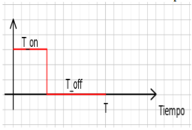
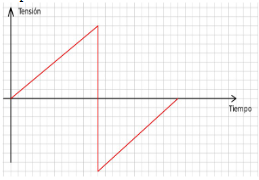

# Exam 2023 - Second

## Modules
- LPC17xx Peripheral Drivers: ADC, DAC, DMA, Timer, EXTI.
- Embedded System Programming: Use of DMA for efficient data transfer and external interrupt handling, PWM measurement, duty cycle calculation.

## First Problem

Programar el microcontrolador LPC1769 en un código de lenguaje C para que, utilizando un timer y un pin de capture de esta placa sea posible demodular una señal PWM que ingresa por dicho pin (calcular el ciclo de trabajo y el periodo) y sacar una tensión continua proporcional al ciclo de trabajo a través del DAC de rango dinámico 0-2V con un rate de actualización de 0,5s del promedio de las últimos diez valores obtenidos en la captura.

<p align="center">
  
</p>

<details><summary>Summary</summary>

This solution measures the duty cycle of a PWM signal using Timer1 in capture mode and calculates the average duty cycle of the last 10 measurements. It outputs the corresponding analog voltage (proportional to the duty cycle) using the DAC. The requirements are:

1. PWM Duty Cycle Measurement:
    - Timer1 is configured in capture mode to measure the on-time (t_on) and period (t_total) of a PWM signal
    - The duty cycle is calculed as:
    $$ \text{duty cycle} = \frac{t_{on}}{t_{total}} * 100%
---
2. Analog Output Proportional to Duty Cycle:
    - The average duty cycle is mapped to a DAC value between 0 and 1023 (10-bit DAC resolution).
    - Timer0 triggers the DAC update every 0.5 seconds.

</details>

<details><summary>First Solution</summary>

```c
/**
* @file e2-2023-ex1-v1.c
* @brief Simple Solution for the First Problem of the Second 2023 Exam from Digital Electronics 3
* @author Ignacio Ledesma
* @license MIT
* @date 2024-11
*/

#include "LPC17xx.h"
#include "lpc17xx_timer.h"
#include "lpc17xx_dac.h"
#include "lpc17xx_pinsel.h"

#define LOW_POWER_MODE 1

// Variables to store PWM times
volatile uint32_t t_on = 0;         // High time of the PWM signal
volatile uint32_t t_total = 0;      // Total period of the PWM signal
volatile uint32_t last_rising_edge = 0;  // Timestamp of the last rising edge

// Buffer to store the last 10 duty cycle values
#define NUM_VALORES 10
volatile uint32_t buffer_duty_cycle[NUM_VALORES] = {0};

// Global variables
volatile uint8_t indice = 0;  // Buffer index
volatile uint8_t n_capture = 0; // 1: rising edge, 2: falling edge, 3: next period

// Function prototypes
void config_pins(void);
void init_timer1_capture(void);
void init_timer0_dac(void);
void init_dac(void);
uint32_t calcular_promedio(void);

int main(void) {
    SystemInit();
    
    // Configure pins for PWM capture and DAC output
    config_pins();
    
    // Initialize Timer1 for PWM signal capture
    init_timer1_capture();

    // Initialize Timer0 for periodic DAC updates
    init_timer0_dac();

    // Initialize the DAC
    init_dac();

    while (1) {
        // Main loop is empty as interrupts handle all the processing
    }

    return 0;
}

void config_pins(void) {
    PINSEL_CFG_Type pin;

    // Configure P1.18 as CAP1.0 for PWM capture
    pin.Portnum = PINSEL_PORT_1;
    pin.Pinnum = PINSEL_PIN_18;
    pin.Funcnum = PINSEL_FUNC_3; // Capture function
    pin.Pinmode = PINSEL_PINMODE_PULLDOWN; // Enable pull-down resistor
    pin.OpenDrain = PINSEL_PINMODE_NORMAL;
    PINSEL_ConfigPin(&pin);

    // Configure P0.26 as DAC output
    pin.Portnum = PINSEL_PORT_0;
    pin.Pinnum = PINSEL_PIN_26;
    pin.Funcnum = PINSEL_FUNC_2; // DAC function
    pin.Pinmode = PINSEL_PINMODE_TRISTATE; // Tristate to prevent output imprecision
    PINSEL_ConfigPin(&pin);
}

// Initialize the DAC
void init_dac(void) {
    DAC_SetBias(LPC_DAC, LOW_POWER_MODE); // Configure DAC in low-power mode
    DAC_Init(LPC_DAC);  // Initialize the DAC
}

// Initialize Timer1 for PWM capture on CAP1.0
void init_timer1_capture(void) {
    TIM_TIMERCFG_Type timer_cfg;
    TIM_CAPTURECFG_Type capture_cfg;

    // Configure Timer1 to count at 1 MHz (1 us per tick)
    timer_cfg.PrescaleOption = TIM_PRESCALE_TICKVAL;
    timer_cfg.PrescaleValue = 100;  // 100 MHz / 100
    TIM_Init(LPC_TIM1, TIM_TIMER_MODE, &timer_cfg);

    // Configure capture on both rising and falling edges
    capture_cfg.CaptureChannel = 0;
    capture_cfg.RisingEdge = ENABLE;
    capture_cfg.FallingEdge = ENABLE;
    capture_cfg.IntOnCaption = ENABLE;  // Enable interrupt on capture

    TIM_ConfigCapture(LPC_TIM1, &capture_cfg);

    // Enable Timer1 interrupts
    NVIC_EnableIRQ(TIMER1_IRQn);
    NVIC_SetPriority(TIMER1_IRQn, 2);

    // Start Timer1
    TIM_Cmd(LPC_TIM1, ENABLE);
}

// Timer1 interrupt handler for PWM capture
void TIMER1_IRQHandler(void) {
    uint32_t captura_actual = TIM_GetCaptureValue(LPC_TIM1, TIM_COUNTER_INCAP0);
    n_capture++;

    switch (n_capture) {
        // Rising edge
        case 1:
            last_rising_edge = captura_actual;  // Store timestamp of rising edge
            break;
        // Falling edge
        case 2:
            t_on = captura_actual - last_rising_edge;  // Calculate high time
            break;
        // New period
        case 3:
            t_total = captura_actual - last_rising_edge;  // Calculate total period
            last_rising_edge = captura_actual;  // Update rising edge timestamp
            n_capture = 1; // Reset to capture the next rising edge
            
            // Store duty cycle in buffer
            save_duty();
            break;
    }

    // Clear Timer1 capture interrupt flag
    TIM_ClearIntCapturePending(LPC_TIM1, 0);
}

// Save the duty cycle to the buffer
void save_duty(void) {
    uint32_t duty_cycle = 0;   // Duty cycle (%)
    if (t_total > 0) {
        duty_cycle = (t_on * 100) / t_total;  // Calculate duty cycle as a percentage
    }

    // Store the duty cycle in the buffer
    buffer_duty_cycle[indice] = duty_cycle;
    indice++;
    if (indice == NUM_VALORES) {
        indice = 0;
    }
}

// Initialize Timer0 for periodic DAC updates
void init_timer0_dac(void) {
    TIM_TIMERCFG_Type timer_cfg;
    TIM_MATCHCFG_Type match_cfg;

    // Configure Timer0 to count in microseconds
    timer_cfg.PrescaleOption = TIM_PRESCALE_USVAL;
    timer_cfg.PrescaleValue = 1000; // Timer0 increments every 1 ms
    TIM_Init(LPC_TIM0, TIM_TIMER_MODE, &timer_cfg);
    
    // Generate interrupt every 500 ms
    match_cfg.MatchChannel = 0;
    match_cfg.IntOnMatch = ENABLE;
    match_cfg.StopOnMatch = DISABLE;
    match_cfg.ResetOnMatch = ENABLE;
    match_cfg.MatchValue = 500; // Match value for 500 ms
    TIM_ConfigMatch(LPC_TIM0, &match_cfg);

    // Enable Timer0 interrupts
    NVIC_EnableIRQ(TIMER0_IRQn);
    NVIC_SetPriority(TIMER0_IRQn, 1);

    // Start Timer0
    TIM_Cmd(LPC_TIM0, ENABLE);
}

// Timer0 interrupt handler for DAC updates
void TIMER0_IRQHandler(void) {
    uint32_t promedio = calcular_promedio();

    // Map the average duty cycle to a DAC value (0-1023)
    uint32_t valor_dac = ((promedio / 100) * 1023);  // Map 0-100% to 0-1023
    DAC_UpdateValue(LPC_DAC, valor_dac);
}

// Calculate the average of the last 10 duty cycle values
uint32_t calcular_promedio(void) {
    uint32_t suma = 0;
    for (uint8_t i = 0; i < NUM_VALORES; i++) {
        suma += buffer_duty_cycle[i];
    }
    return suma / NUM_VALORES;  // Return average duty cycle (%)
}
```

</details>

<details><summary>Second Solution</summary>

```c
/**
* @file e2-2023-ex1-v2.c
* @brief Complex Solution for the First Problem of the Second 2023 Exam from Digital Electronics 3
* @author Ignacio Ledesma
* @license MIT
* @date 2024-11
*/

#include "LPC17xx.h"
#include "lpc17xx_timer.h"
#include "lpc17xx_dac.h"
#include "lpc17xx_pinsel.h"
#include "lpc17xx_gpdma.h"

#define LOW_POWER_MODE 1
#define CLOCK_DAC_MHZ  25 // DAC clock: 25 MHz (CCLK divided by 4)
#define DESIRED_DAC_RATE 2 // 0.5 s = 2 Hz
#define DMA_CHANNEL_0 0

// Capture times for PWM
volatile uint32_t t_on = 0;         // High time of the PWM signal
volatile uint32_t t_total = 0;      // Total period of the PWM signal
volatile uint32_t last_rising_edge = 0;  // Timestamp of the last rising edge

// Buffer for duty cycle values
#define NUM_VALORES 10
volatile uint32_t buffer_duty_cycle[NUM_VALORES] = {0};

// Global variables
volatile uint8_t indice = 0;  // Buffer index
volatile uint8_t n_capture = 0; // Capture state (1: rising, 2: falling, 3: next period)
volatile uint16_t dac_value = 0; // Value to be sent to the DAC

// Function prototypes
void config_pins(void);
void init_timer1_capture(void);
void init_dma(void);
void init_dac(void);
void calcular_valor_dac(void);

int main(void) {
    SystemInit();

    // Configure pins for PWM capture and DAC output
    config_pins();
    
    // Initialize Timer1 for PWM signal capture
    init_timer1_capture();

    // Initialize the DAC
    init_dac();

    // Initialize DMA for DAC updates
    init_dma();

    // Start DMA Channel 0
    GPDMA_ChannelCmd(DMA_CHANNEL_0, ENABLE);

    while (1) {
        // Main loop is empty as interrupts and DMA handle all processing
    }

    return 0;
}

// Configure pins for Timer1 CAP1.0 and DAC
void config_pins(void) {
    PINSEL_CFG_Type pin;

    // Configure P1.18 as CAP1.0
    pin.Portnum = PINSEL_PORT_1;
    pin.Pinnum = PINSEL_PIN_18;
    pin.Funcnum = PINSEL_FUNC_3;
    pin.Pinmode = PINSEL_PINMODE_PULLDOWN;
    pin.OpenDrain = PINSEL_PINMODE_NORMAL;
    PINSEL_ConfigPin(&pin);

    // Configure P0.26 as DAC output
    pin.Portnum = PINSEL_PORT_0;
    pin.Pinnum = PINSEL_PIN_26;
    pin.Funcnum = PINSEL_FUNC_2;
    pin.Pinmode = PINSEL_PINMODE_TRISTATE;
    PINSEL_ConfigPin(&pin);
}

// Initialize DAC with DMA support
void init_dac(void) {
    DAC_CONVERTER_CFG_Type dac_cfg;
    dac_cfg.CNT_ENA = ENABLE;
    dac_cfg.DMA_ENA = ENABLE;
    DAC_ConfigDAConverterControl(LPC_DAC, &dac_cfg);
    DAC_SetBias(LPC_DAC, LOW_POWER_MODE);
    uint32_t ticks_until_update = (CLOCK_DAC_MHZ * 1000000) / DESIRED_DAC_RATE;
    DAC_SetDMATimeOut(LPC_DAC, ticks_until_update);
    DAC_Init(LPC_DAC);
}

// Initialize Timer1 for PWM capture
void init_timer1_capture(void) {
    TIM_TIMERCFG_Type timer_cfg;
    TIM_CAPTURECFG_Type capture_cfg;

    timer_cfg.PrescaleOption = TIM_PRESCALE_TICKVAL;
    timer_cfg.PrescaleValue = 100;  // 100 MHz / 100 = 1 MHz (1 us per tick)
    TIM_Init(LPC_TIM1, TIM_TIMER_MODE, &timer_cfg);

    capture_cfg.CaptureChannel = 0;
    capture_cfg.RisingEdge = ENABLE;
    capture_cfg.FallingEdge = ENABLE;
    capture_cfg.IntOnCaption = ENABLE;

    TIM_ConfigCapture(LPC_TIM1, &capture_cfg);

    NVIC_EnableIRQ(TIMER1_IRQn);
    NVIC_SetPriority(TIMER1_IRQn, 2);

    TIM_Cmd(LPC_TIM1, ENABLE);
}

// Timer1 interrupt handler for PWM capture
void TIMER1_IRQHandler(void) {
    uint32_t captura_actual = TIM_GetCaptureValue(LPC_TIM1, TIM_COUNTER_INCAP0);
    n_capture++;

    switch (n_capture) {
        case 1: // Rising edge
            last_rising_edge = captura_actual;
            break;
        case 2: // Falling edge
            t_on = captura_actual - last_rising_edge;
            break;
        case 3: // New period
            t_total = captura_actual - last_rising_edge;
            last_rising_edge = captura_actual;
            n_capture = 1;
            save_duty();
            break;
    }

    TIM_ClearIntCapturePending(LPC_TIM1, 0);
}

// Store the duty cycle and compute DAC value
void save_duty(void) {
    uint32_t duty_cycle = 0;
    if (t_total > 0) {
        duty_cycle = (t_on * 100) / t_total;
    }
    buffer_duty_cycle[indice] = duty_cycle;
    indice++;
    if (indice == NUM_VALORES) {
        calcular_valor_dac();
        indice = 0;
    }
}

// Calculate DAC value based on duty cycle average
void calcular_valor_dac(void) {
    uint32_t suma = 0;
    for (uint8_t i = 0; i < NUM_VALORES; i++) {
        suma += buffer_duty_cycle[i];
    }
    dac_value = (suma / (NUM_VALORES * 100)) * 1023;
}

// Initialize DMA for DAC updates
void init_dma(void) {
    GPDMA_Channel_CFG_Type dma_cfg;
    dma_cfg.ChannelNum = DMA_CHANNEL_0;
    dma_cfg.SrcMemAddr = (uint32_t)&dac_value;
    dma_cfg.DstMemAddr = 0; // Destination: DAC peripheral
    dma_cfg.TransferSize = 1;
    dma_cfg.TransferWidth = 0; // Not used for memory-to-peripheral transfers
    dma_cfg.TransferType = GPDMA_TRANSFERTYPE_M2P;
    dma_cfg.SrcConn = 0;
    dma_cfg.DstConn = GPDMA_CONN_DAC;
    dma_cfg.DMALLI = 0;

    GPDMA_Setup(&dma_cfg);
}
```


</details>

<details><summary>Differences Between Solutions</summary>

### **Solution 1**

#### **Summary**

This solution measures the duty cycle of a PWM signal using **Timer1** in capture mode and calculates the average duty cycle of the last 10 measurements. It outputs the corresponding analog voltage (proportional to the duty cycle) using the DAC.

#### **Key Requirements Addressed**
1. **PWM Duty Cycle Measurement**:
   - Timer1 is configured in capture mode to measure the on-time (`t_on`) and period (`t_total`) of a PWM signal.
   - The duty cycle is calculated as 
   $$ \text{duty cycle} = \frac{t_{\text{on}}}{t_{\text{total}}} * 100% $$.

2. **Analog Output Proportional to Duty Cycle**:
   - The average duty cycle is mapped to a DAC value between 0 and 1023 (10-bit DAC resolution).
   - Timer0 triggers the DAC update every 0.5 seconds.

#### **Code Highlights**
- **Capture Mode for PWM Measurement**:
   Timer1 captures both rising and falling edges of the PWM signal, storing the times to calculate the on-time and total period.

- **Buffer for Averaging**:
   The last 10 duty cycle measurements are stored in a buffer to calculate the average duty cycle, ensuring a smooth output.

- **DAC Output**:
   The DAC outputs a voltage proportional to the average duty cycle, ranging from 0V (0% duty cycle) to 2V (100% duty cycle).

---

### **Solution 2**

#### **Summary**

This solution extends the first by incorporating **DMA** for transferring the calculated DAC values directly to the DAC register. This reduces CPU intervention, making it more efficient for continuous updates.

#### **Key Requirements Addressed**
1. **PWM Duty Cycle Measurement**:
   - Similar to Solution 1, Timer1 captures the on-time and period of a PWM signal.
   - The duty cycle is calculated and averaged over the last 10 measurements.

2. **DMA Integration for DAC Output**:
   - DMA transfers the calculated DAC value from memory to the DAC register automatically.
   - The CPU only calculates the DAC value and updates it in memory; the DMA handles the rest.

3. **Efficient DAC Updates**:
   - The DAC update rate is set using the **DAC timeout feature** and the DMA.

#### **Code Highlights**
- **Capture Mode for PWM Measurement**:
   Same as Solution 1.

- **DMA for DAC Updates**:
   The calculated DAC value is stored in a memory location. DMA transfers this value to the DAC register at regular intervals.

- **DAC Timeout Configuration**:
   The DAC timeout is configured to match the desired DAC update rate (2 Hz in this example).

---

### **Differences Between Solutions**

| Aspect                        | Solution 1                              | Solution 2                              |
|-------------------------------|-----------------------------------------|-----------------------------------------|
| **DAC Updates**               | CPU updates the DAC directly            | DMA handles DAC updates                 |
| **Efficiency**                | CPU is involved in every DAC update     | Offloads DAC updates to DMA             |
| **Update Rate Control**       | Timer0 triggers updates                 | DAC timeout and DMA manage updates      |
| **Hardware Utilization**      | Timer0, Timer1, DAC                     | Timer1, DAC, DMA                        |
| **Complexity**                | Simpler, no DMA configuration           | More complex, requires DMA setup        |

### **Advantages**
- **Solution 1**:
  - Easier to implement and debug.
  - Suitable for applications with lower performance requirements.
- **Solution 2**:
  - Offloads work to DMA, freeing the CPU for other tasks.
  - Ideal for real-time applications where precise timing and efficient resource utilization are critical.

### **Use Cases**
- Use **Solution 1** for simpler systems where CPU utilization is not a concern.
- Use **Solution 2** for high-performance systems or applications requiring minimal CPU involvement.

</details>

## Second Problem

Programar el microcontrolador LPC1769 en un código de lenguaje C para que mediante su ADC digitalice una señal analógica cuyo ancho de banda es de 16 khz. La señal analógica tiene una amplitud de pico máxima positiva de 3.3 voltios. Los datos deben ser guardados utilizando el Hardware GDMA en la primera mitad de la memoria SRAM ubicada en el bloque AHB SRAM - bank 0, de manera tal que permita almacenar todos los datos posibles que esta memoria nos permita. Los datos deben ser almacenados como un buffer circular conservando siempre las últimas muestras.

Por otro lado se tiene una forma de onda como se muestra en la imagen a continuación. Esta señal debe ser generada por una función y debe ser reproducida por el DAC desde la segunda mitad de AHB SRAM - bank 0 memoria utilizando DMA de tal forma que se logre un periodo de 614us logrando la máxima resolución y máximo rango de tensión.

Durante operación normal se debe generar por el DAC la forma de onda mencionada como wave_form. Se debe indicar cuál es el mínimo incremento de tensión de salida de esa forma de onda.

Cuando interrumpe una extint conectada a un pin, el ADC configurado debe completar el ciclo de conversión que estaba realizando, y ser detenido, a continuación se comienzan a sacar las muestras del ADC por el DAC utilizando DMA y desde las posiciones de memoria originales.

Cuando interrumpe nuevamente en el mismo pin, se vuelve a repetir la señal del DAC generada por la forma de onda de wave_form previamente almacenada y se arranca de nuevo la conversión de datos del adc. Se alterna así entre los dos estados del sistema con cada interrupción externa.
Suponer una frecuencia de core cclk de 80 Mhz. El código debe estar debidamente comentado.

<p align="center">
  
</p>

<details><summary>Summary</summary>

This task involves:

1. **Digitizing a 16 kHz analog signal** with a 3.3V peak amplitude using the ADC of the LPC1769. Data must be stored in a **circular buffer** in SRAM bank 0 with **DMA**.
2. **Generating a triangular waveform** using the DAC, sourced from a pre-computed waveform stored in memory. The DAC should achieve:
   - A period of **614 µs**.
   - Maximum resolution and voltage range.
   - DMA handling for efficient data transfer to the DAC.
3. **System Modes**:
   - Mode 1: ADC captures data to memory using DMA.
   - Mode 2: Data is transferred from memory to the DAC for playback, also using DMA.
   - Modes switch on an external interrupt.

</details>

<details><summary>Solution</summary>

### **Warning**: this solution could have mistakes. Contributions are welcome! Please open an issue or submit a pull request if you have suggestions or improvements.

```c
/**
* @file e2-2023-ex2.c
* @brief Solution for the Second Problem of the Second 2023 Exam from Digital Electronics 3
* @author Ignacio Ledesma
* @license MIT
* @date 2024-11
*/

#include "LPC17xx.h"
#include "lpc17xx_adc.h"
#include "lpc17xx_dac.h"
#include "lpc17xx_gpdma.h"
#include "lpc17xx_timer.h"
#include "lpc17xx_exti.h"

// SRAM Bank 0 Memory Addresses
#define SRAM_BANK_0_START 0x10000000
#define ADC_BUFFER_START  SRAM_BANK_0_START
#define DAC_BUFFER_START  (SRAM_BANK_0_START + NUM_SAMPLES)

// System Parameters
#define NUM_SAMPLES     1024      // Max resolution
#define DAC_PERIOD_US   614       // DAC waveform period
#define CORE_CLOCK      80000000  // 80 MHz
#define ADC_FREQ        32000     // Nyquist -> 16 kHz * 2

// Global Variables
volatile uint8_t adc_mode = 1;    // 1: ADC mode, 0: DAC mode
uint16_t dac_waveform[NUM_SAMPLES]; // Precomputed triangular waveform

// DMA Structures
GPDMA_Channel_CFG_Type dma_adc_cfg;
GPDMA_Channel_CFG_Type dma_dac_cfg;
GPDMA_LLI_Type lli_adc, lli_dac;

// Function Prototypes
void config_pins(void);
void init_adc_dma(void);
void init_dac_dma(void);
void init_timer_for_adc(void);
void init_ext_interrupt(void);
void generate_triangular_waveform(void);

int main(void) {
    SystemInit(); // Initialize system clock
    
    config_pins();
    generate_triangular_waveform();
    init_adc_dma();
    init_dac_dma();
    init_timer_for_adc();
    init_ext_interrupt();

    while (1) {
        __WFI(); // Wait for interrupts
    }

    return 0;
}

// Configure pins for ADC, DAC, and external interrupt
void config_pins(void) {
    PINSEL_CFG_Type pin;

    // ADC Channel 0 (P0.23)
    pin.Portnum = PINSEL_PORT_0;
    pin.Pinnum = PINSEL_PIN_23;
    pin.Funcnum = PINSEL_FUNC_1;  // ADC function
    pin.Pinmode = PINSEL_PINMODE_TRISTATE;
    PINSEL_ConfigPin(&pin);

    // DAC (P0.26)
    pin.Pinnum = PINSEL_PIN_26;
    pin.Funcnum = PINSEL_FUNC_2;  // DAC function
    PINSEL_ConfigPin(&pin);

    // External interrupt (EINT0 on P2.10)
    pin.Portnum = PINSEL_PORT_2;
    pin.Pinnum = PINSEL_PIN_10;
    pin.Funcnum = PINSEL_FUNC_1;  // EXTI function
    pin.Pinmode = PINSEL_PINMODE_PULLUP;
    PINSEL_ConfigPin(&pin);
}

// Generate a triangular waveform in the DAC buffer
void generate_triangular_waveform(void) {
    for (uint32_t i = 0; i < NUM_SAMPLES / 2; i++) {
        dac_waveform[i] = (i * 1023) / (NUM_SAMPLES / 2); // Rising slope
    }
    for (uint32_t i = NUM_SAMPLES / 2; i < NUM_SAMPLES; i++) {
        dac_waveform[i] = 1023 - ((i - NUM_SAMPLES / 2) * 1023) / (NUM_SAMPLES / 2); // Falling slope
    }
}

// Configure DMA for ADC to SRAM transfer
void init_adc_dma(void) {
    ADC_Init(LPC_ADC, ADC_FREQ);
    ADC_ChannelCmd(LPC_ADC, ADC_CHANNEL_0, ENABLE);
    ADC_BurstCmd(LPC_ADC, ENABLE); // Enable burst mode

    // DMA Configuration
    GPDMA_Init();
    dma_adc_cfg.ChannelNum = 0;
    dma_adc_cfg.SrcMemAddr = 0;
    dma_adc_cfg.DstMemAddr = (uint32_t)ADC_BUFFER_START;
    dma_adc_cfg.TransferSize = NUM_SAMPLES;
    dma_adc_cfg.TransferWidth = GPDMA_WIDTH_HALFWORD; // 16-bit transfer
    dma_adc_cfg.TransferType = GPDMA_TRANSFERTYPE_P2M; // Peripheral to memory
    dma_adc_cfg.SrcConn = GPDMA_CONN_ADC;
    dma_adc_cfg.DstConn = 0;
    dma_adc_cfg.DMALLI = 0; // No linked list

    GPDMA_Setup(&dma_adc_cfg);
    GPDMA_ChannelCmd(0, ENABLE);
}

// Configure DMA for SRAM to DAC transfer
void init_dac_dma(void) {
    DAC_Init(LPC_DAC);

    // Configure DAC with DMA
    GPDMA_Init();
    dma_dac_cfg.ChannelNum = 1;
    dma_dac_cfg.SrcMemAddr = (uint32_t)DAC_BUFFER_START;
    dma_dac_cfg.DstMemAddr = (uint32_t)&LPC_DAC->DACR;
    dma_dac_cfg.TransferSize = NUM_SAMPLES;
    dma_dac_cfg.TransferWidth = GPDMA_WIDTH_HALFWORD; // 16-bit transfer
    dma_dac_cfg.TransferType = GPDMA_TRANSFERTYPE_M2P; // Memory to peripheral
    dma_dac_cfg.SrcConn = 0;
    dma_dac_cfg.DstConn = GPDMA_CONN_DAC;
    dma_dac_cfg.DMALLI = 0; // No linked list

    GPDMA_Setup(&dma_dac_cfg);
}

// Configure Timer0 to trigger ADC at 16 kHz
void init_timer_for_adc(void) {
    TIM_TIMERCFG_Type timer_cfg;
    TIM_MATCHCFG_Type match_cfg;

    timer_cfg.PrescaleOption = TIM_PRESCALE_USVAL;
    timer_cfg.PrescaleValue = 1;

    TIM_Init(LPC_TIM0, TIM_TIMER_MODE, &timer_cfg);

    match_cfg.MatchChannel = 0;
    match_cfg.IntOnMatch = ENABLE;
    match_cfg.ResetOnMatch = ENABLE;
    match_cfg.StopOnMatch = DISABLE;
    match_cfg.MatchValue = 63; // 16 kHz (1 / 63 µs)
    TIM_ConfigMatch(LPC_TIM0, &match_cfg);

    TIM_Cmd(LPC_TIM0, ENABLE);
}

// Configure external interrupt for mode switching
void init_ext_interrupt(void) {
    EXTI_Init();
    EXTI_InitTypeDef exti_cfg;

    exti_cfg.EXTI_Line = EXTI_EINT0;
    exti_cfg.EXTI_Mode = EXTI_MODE_EDGE_SENSITIVE;
    exti_cfg.EXTI_polarity = EXTI_POLARITY_LOW_ACTIVE_OR_FALLING_EDGE;

    EXTI_Config(&exti_cfg);

    NVIC_EnableIRQ(EINT0_IRQn);
}

// Handle external interrupt for mode switching
void EINT0_IRQHandler(void) {
    if (adc_mode) {
        GPDMA_ChannelCmd(0, DISABLE); // Stop ADC DMA
        GPDMA_ChannelCmd(1, ENABLE); // Start DAC DMA
        adc_mode = 0;
    } else {
        GPDMA_ChannelCmd(1, DISABLE); // Stop DAC DMA
        GPDMA_ChannelCmd(0, ENABLE); // Start ADC DMA
        adc_mode = 1;
    }

    EXTI_ClearEXTIFlag(EXTI_EINT0); // Clear interrupt flag
}
```
</details>

## Third Problem

Describa la función del bit BIAS de DAC del microcontrolador LPC1769.

<details><summary>Solution</summary>

The **BIAS bit** of the **DAC** in the **LPC1769** microcontroller has the function of **controlling the current mode** of the DAC, affecting both the **power consumption** and the **conversion speed**. It allows balancing **performance** and **power efficiency** based on the application’s requirements.

### **BIAS bit function in the DAC**

The **BIAS** bit has two possible configurations:

1. **BIAS = 0**: **Fast mode** (maximum conversion speed).
   - In this mode, the **DAC** operates at its maximum speed, enabling faster conversions.
   - However, this mode consumes more energy.
   - The **conversion time** is lower (around **1 µs**).
   - The **frequency** is higher (**1 MHz** maximum).

2. **BIAS = 1**: **Low-power mode**.
   - In this mode, the **DAC** operates at a slower speed, reducing power consumption.
   - The **conversion time** is higher (around **2.5 µs**).
   - It is ideal when fast conversion is not needed, and energy savings are prioritized.
   - The **frequency** is lower (**400 KHz** maximum).

### **Use of the BIAS bit**

- The BIAS bit is used to optimize the **DAC performance** according to the application’s needs. If the application requires **high conversion speed**, the DAC can be configured in fast mode (**BIAS = 0**), but if **energy saving** is the priority, the low-power mode (**BIAS = 1**) is more appropriate.

### **Example in code**

```c
// Configure the DAC in fast mode (BIAS = 0)
LPC_DAC->DACR &= ~(1 << 16);  // BIAS = 0, fast mode

// Configure the DAC in low-power mode (BIAS = 1)
LPC_DAC->DACR |= (1 << 16);  // BIAS = 1, low-power mode
```

Also, using CMSIS:

```c
DAC_SetBias(LPC_DAC, 0); // Fast mode
DAC_SetBias(LPC_DAC, 1); // Low-power mode
```

</details>
